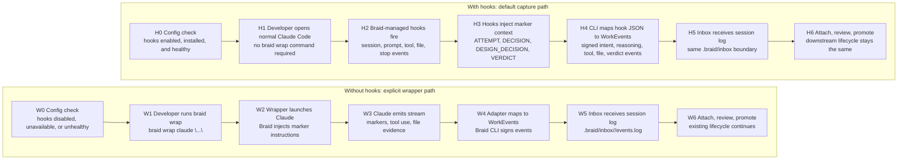

# Braid Capture: `braid wrap` vs Claude Hooks

This note captures the proposed capture model split:

- Without hooks, Braid capture remains explicit through `braid wrap`.
- With hooks, Braid capture becomes the default path for normal Claude Code sessions.
- In both cases, the Braid CLI remains the component that signs and writes WorkEvents into `.braid/inbox`.
- Downstream lifecycle remains unchanged: `attach` imports events, SQLite stores them, review inspects them, and promote writes provenance.

## Diagram



## Routing Rule

```text
capture.claude_hooks.enabled=true
+ hooks installed
+ hooks healthy
+ supported hook version
= hook capture path

anything else
= braid wrap fallback path, or warning if capture was expected
```

## Config And Health Model

| Field | Type | Meaning |
| --- | --- | --- |
| `capture.claude_hooks.enabled` | Config flag | User/project intent to use Claude hooks as the primary capture path. |
| `capture.claude_hooks.installed` | Observed state or status output | Whether the expected Claude hook config/files are present. |
| `capture.claude_hooks.version` | Observed state | Version of the Braid-managed hook block, so Braid can detect stale hooks. |
| `capture.claude_hooks.healthy` | Computed check | True only when hooks exist, point to the Braid CLI, are executable, and match the expected schema/version. |
| `capture.mode` | Derived state | `hooks`, `wrap`, or `disabled`, based on config plus health checks. |

## Hook Capture Design

In hook mode, the developer should be able to open Claude Code normally. Braid-managed Claude hooks invoke the Braid CLI behind the scenes. The CLI receives hook JSON, maps it to Braid WorkEvents, signs those events, and appends them to `.braid/inbox/<session>/events.log`.

The important product goal is zero developer overhead: no new command is needed for normal captured sessions once hooks are installed and enabled.

## Sample Claude Hook Config

This is the shape of a Braid-managed Claude hook block. The exact command names can change, but the important contract is that Claude hooks call the Braid CLI, and the CLI owns signing and writing WorkEvents.

```json
{
  "hooks": {
    "SessionStart": [
      {
        "hooks": [
          {
            "type": "command",
            "command": "braid hook ingest --event session-start",
            "async": true
          }
        ]
      }
    ],
    "UserPromptSubmit": [
      {
        "hooks": [
          {
            "type": "command",
            "command": "braid hook ingest --event user-prompt-submit",
            "async": true
          }
        ]
      }
    ],
    "PreToolUse": [
      {
        "matcher": "*",
        "hooks": [
          {
            "type": "command",
            "command": "braid hook ingest --event pre-tool-use",
            "async": true
          }
        ]
      }
    ],
    "PostToolUse": [
      {
        "matcher": "*",
        "hooks": [
          {
            "type": "command",
            "command": "braid hook ingest --event post-tool-use",
            "async": true
          }
        ]
      }
    ],
    "FileChanged": [
      {
        "hooks": [
          {
            "type": "command",
            "command": "braid hook ingest --event file-changed",
            "async": true
          }
        ]
      }
    ],
    "Stop": [
      {
        "hooks": [
          {
            "type": "command",
            "command": "braid hook ingest --event stop",
            "async": true
          }
        ]
      }
    ],
    "SessionEnd": [
      {
        "hooks": [
          {
            "type": "command",
            "command": "braid hook ingest --event session-end",
            "async": true
          }
        ]
      }
    ]
  },
  "braid": {
    "managedBy": "braid",
    "hookSchema": "claude-code-hooks-v1",
    "capture": {
      "claude_hooks": {
        "enabled": true
      }
    }
  }
}
```

The hook command should read the Claude hook JSON from stdin. For context-injection hooks such as `SessionStart` or `UserPromptSubmit`, it may return hook output that adds Braid marker guidance. For observation hooks such as `PostToolUse` or `FileChanged`, it should usually capture and exit without changing Claude's behavior.

## Suggested Hook Mapping

| Claude hook | Braid capture role |
| --- | --- |
| `SessionStart` | Create `agent_start`; optionally inject capture marker instructions. |
| `UserPromptSubmit` | Capture user intent; optionally add marker guidance as context. |
| `MessageDisplay` | Capture visible reasoning/design narrative when available. |
| `PreToolUse` | Capture planned tool action; optionally enforce scope guards before execution. |
| `PostToolUse` | Capture completed tool action and result metadata. |
| `FileChanged` | Capture file-change evidence and scope-relevant paths. |
| `Stop` | Capture terminal marker, especially one final `VERDICT`. |
| `SessionEnd` | Create `agent_end` and close the session envelope. |

## Marker Guidance Injected By Hooks

Hooks can inject the same marker guidance that `braid wrap` currently adds:

```text
Use Braid capture markers on their own concise lines:
ATTEMPT <n>: <one-line approach>
DECISION: kept - <reason> / DECISION: rejected - <reason>
REFINED UNDERSTANDING: <what changed>
DESIGN_DECISION: choice=<decision> | alternatives=<alternatives> | reason=<why finalized>
VERDICT: verify_passed / verify_failed - <reason> / needs_human - <reason>
```

## Fallback Behavior

`braid wrap` should remain available as the compatibility path when:

- Claude hooks are not installed.
- Hooks are disabled by config.
- Hook health checks fail.
- The environment does not support Claude hooks.
- The user explicitly wants wrapper capture for a controlled run.

Long term, when hooks are installed and healthy, `braid wrap` can be treated as fallback/legacy capture rather than the normal developer workflow.

## Guard Against Double Capture

Braid should avoid capturing the same session twice. If a wrapped session is running, hook capture should either disable itself for that session or recognize a `BRAID_WRAP_ACTIVE`-style environment marker and skip duplicate writes.

Recommended routing:

```text
if BRAID_WRAP_ACTIVE:
  use wrapper capture only
else if capture.claude_hooks.enabled && hooks healthy:
  use hook capture
else:
  use braid wrap fallback when explicit capture is requested
```
