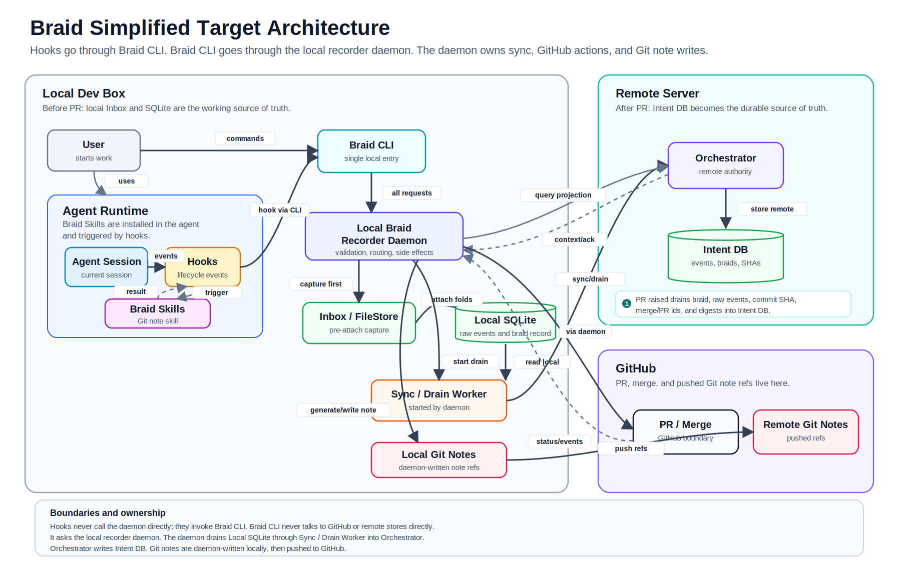

# Proposed Braid Architecture -Simplified

Braid is a provider-independent coordination, evidence, and promotion layer for agent-produced software work. The proposed architecture gives agent sessions a controlled local capture path, preserves work and intent before integration, moves durable lifecycle state to a remote authority after the pull-request checkpoint is acknowledged, and projects accepted context back into Git through notes.

This is a **target architecture**. It describes the intended component boundaries and ownership model; it should not be read as a statement that every component or transition is already implemented.

## Architecture Diagram

The simplified Braid target-architecture diagram is embedded below.



[Open the full-size SVG](assets/braid-work-events/braid-simplified-target-architecture.svg)

[Open the PNG](assets/braid-work-events/braid-simplified-target-architecture.png)

## Architectural Zones

The architecture is divided into three ownership zones:

1. **Local Dev Box** - captures agent work; Local SQLite remains the attached working source of truth before remote acknowledgement.
2. **Remote Server** - stores the durable intent and lifecycle record after the pull-request checkpoint is acknowledged.
3. **Git Provider** - hosts pull requests, merges, code refs, and pushed Git-note refs. GitHub is the illustrated provider.

GitHub is shown as the concrete Git provider in the diagram. Braid reaches it through a Git Provider Adapter so the lifecycle model remains independent of a particular provider.

## 1. Local Dev Box

The local development environment contains the agent integration, the only local command entry point, the recorder daemon, temporary event capture, the attached braid database, local Git-note refs, and the local side of the Git Provider Adapter.

### Agent runtime

The user starts work through an agent runtime. A session may include the current agent and any subagents or independent work sessions it starts.

Braid Skills are installed in the agent environment and are triggered through lifecycle hooks. The skills provide reusable procedures such as Git-note synthesis, while hooks provide deterministic event triggers around agent activity.

### Hooks and Braid CLI

Hooks never communicate directly with the recorder daemon. Every hook event goes through the Braid CLI:

```text
Agent Session -> Hooks -> Braid CLI -> Local Braid Recorder Daemon
```

The Braid CLI is the single local entry point for:

- user lifecycle commands;
- hook-emitted work events;
- agent-triggered Braid skills;
- status and result reporting.

The CLI is intentionally thin. It validates the command envelope, forwards requests to the daemon, and presents results. It does not directly own remote synchronization, GitHub operations, or durable note writes.

### Local Braid Recorder Daemon

The Local Braid Recorder Daemon owns local validation, routing, and side effects. It is the component responsible for:

- accepting requests from the Braid CLI;
- capturing events into the Inbox/FileStore;
- folding attached events into Local SQLite;
- starting the Sync/Drain Worker;
- querying local braid and thread state;
- invoking Braid Git Note Skill behavior;
- writing local Git-note refs;
- routing pull-request and merge operations to the Git provider;
- returning lifecycle status to the CLI.

This boundary prevents hooks, skills, and commands from independently mutating persistence or remote systems.

### Inbox / FileStore

The Inbox is a local file store for pre-attach capture. It receives signed or stamped work events as the agent session progresses.

```text
Before attach:
Inbox / FileStore = captured but not yet folded work
```

The Inbox is deliberately a staging boundary, not the authoritative braid projection. Capturing an event does not by itself associate that event with a durable braid or thread.

### Local SQLite

`braid attach` validates the captured event slice and folds accepted events into Local SQLite. SQLite stores the normalized local braid record, thread state, raw stamped events, evidence links, Git identifiers, and lifecycle metadata.

```text
After attach and before PR:
Local SQLite = working source of truth
```

This local database is the authoritative attached projection before the pull-request checkpoint is acknowledged. It supports querying, retry, review preparation, note generation, and recovery without treating the Inbox as the durable braid model.

### Local Git notes

The daemon uses Braid Git Note Skill output to write local Git-note refs at meaningful boundaries. Separate namespaces can represent commit, pull-request-head, and merge projections.

Git notes are useful Git-facing summaries of intent, evidence, review, and promotion state. They are projections, not the authoritative event store.

## 2. Sync and Drain Path

The Sync/Drain Worker is started by the Local Braid Recorder Daemon. It is not invoked directly by hooks or by the CLI.

```text
Braid CLI
  -> Local Braid Recorder Daemon
  -> Sync / Drain Worker
  -> Orchestrator
  -> Intent DB
```

At the pull-request boundary, the worker drains the braid-related projection from Local SQLite to the remote authority. Intent DB becomes authoritative only after the Orchestrator acknowledges the checkpoint. The synchronized envelope includes, as applicable:

- braid and thread records;
- raw stamped WorkEvents;
- scope, evidence, and verdict state;
- commit and head SHAs;
- pull-request identifiers and URLs;
- merge identifiers and merge SHA when available;
- event ranges, sequence information, and integrity digests.

Synchronization should be idempotent and resumable. A remote acknowledgement records the durable identity or projection version accepted by the Orchestrator.

## 3. Remote Server

The remote server contains the Orchestrator and Intent DB.

### Orchestrator

The Orchestrator is the remote authority boundary. It receives synchronized lifecycle envelopes, validates identity and ordering, applies acceptance policy, and writes the durable projection to Intent DB.

Its responsibilities include:

- authenticating the sending repository and actor;
- deduplicating retried events and drains;
- validating sequence continuity and integrity digests;
- associating records with the correct braid, thread, commit, and pull request;
- maintaining versioned pull-request intent as work changes;
- evaluating or coordinating review and promotion authority;
- returning durable acknowledgements and current lifecycle status.

### Intent DB

Intent DB stores the durable remote record of events, braids, threads, identities, Git SHAs, pull requests, review state, and promotion decisions.

The source-of-truth transition is explicit:

```text
Before acknowledged PR checkpoint:
Inbox is raw staging; Local SQLite is the attached working truth.

At PR creation:
The attached braid projection is drained and acknowledged by Intent DB.

After acknowledgement:
Intent DB is the durable source of truth.

At merge:
Braid authorizes the exact current candidate before the provider merge. Remaining
events, the final projection, and merge SHA are then drained before promotion is finalized.
```

After the pull request exists, changed intent must also be captured. New commits, force-pushes, scope changes, review responses, goal changes, and developer edits append deltas to Intent DB and produce a new current projection.

## 4. Git Provider Boundary

The diagram uses GitHub as the concrete provider. Pull-request creation, pull-request updates, candidate authorization, merge completion, and Git-note pushes are routed through the Local Braid Recorder Daemon and a Git Provider Adapter rather than being performed directly by the Braid CLI.

```text
User or Agent
  -> Braid CLI
  -> Local Braid Recorder Daemon
  -> Git Provider Adapter
  -> GitHub
```

The adapter normalizes provider operations and events while the daemon retains side-effect ownership. This lets Braid record the action and its resulting provider identifiers as part of the same governed lifecycle.

### Remote Git notes

Local Git-note refs are pushed to the Git provider after generation. The proposed namespaces correspond to three different object boundaries:

| Boundary | Suggested namespace | Git object anchor |
|---|---|---|
| Commit/session | `refs/notes/agent-commit` | Code commit SHA |
| Pull request | `refs/notes/agent-pr` | Current PR head SHA |
| Merge/promotion | `refs/notes/agent-merge` | Merge commit SHA |

A pull request is not itself a Git object, so the PR note attaches to its head commit and records the provider PR identifier in both the note and Intent DB.

## End-to-End Lifecycle

1. The user or planner establishes a goal, braid, threads, scopes, and authority policy through Braid CLI commands.
2. The agent runtime performs work, and hooks emit lifecycle events through the Braid CLI.
3. The Local Braid Recorder Daemon writes captured events to the Inbox/FileStore.
4. `braid attach` validates the selected event slice and folds it into Local SQLite.
5. Before a pull request exists, Local SQLite remains the working source of truth.
6. A commit boundary can trigger a commit-note projection without promoting the work.
7. Pull-request creation is routed through the daemon and produces a `pr.created` event.
8. The daemon starts the Sync/Drain Worker, which sends braid, thread, event, Git, and integrity data through the Orchestrator into Intent DB.
9. The Orchestrator acknowledges the checkpoint, after which Intent DB becomes the durable source of truth for that pull request.
10. Later PR changes append changed-intent deltas and advance the versioned remote projection.
11. Review evaluates the current candidate, its evidence, scope compliance, and authority policy.
12. Braid authorizes the exact accepted candidate SHA.
13. The daemon uses the Git Provider Adapter to request the provider merge.
14. Merge completion produces a `merge.completed` event and drains the remaining data plus merge SHA.
15. Promotion is finalized against the accepted candidate and resulting merge identity.
16. The daemon generates the merge Git note and pushes the relevant note refs through the adapter.

## Ownership Summary

| Component | Primary responsibility |
|---|---|
| Agent hooks | Emit deterministic lifecycle triggers |
| Braid Skills | Provide reusable agent procedures, including Git-note synthesis |
| Braid CLI | Serve as the single local user, hook, and skill entry point |
| Local Braid Recorder Daemon | Own validation, routing, local persistence, synchronization, Git-provider actions, and note writes |
| Inbox / FileStore | Hold captured pre-attach events |
| Local SQLite | Store the attached local braid, thread, raw-event, evidence, and lifecycle projection |
| Sync / Drain Worker | Move versioned local projections to the remote authority |
| Orchestrator | Validate, deduplicate, apply remote lifecycle policy, and coordinate authority |
| Intent DB | Preserve durable post-PR events, intent, Git identities, review state, and promotion state |
| Git Provider Adapter | Normalize provider operations and events without owning lifecycle authority |
| Git provider | Host code, pull requests, merges, and pushed Git-note refs |

## Core Invariants

- Hooks call the Braid CLI; they never call the daemon directly.
- The Braid CLI calls the daemon; it does not directly mutate remote stores or the Git provider.
- The daemon owns side effects and starts the Sync/Drain Worker.
- Capture into the Inbox is distinct from association through `braid attach`.
- The Inbox is raw staging; Local SQLite is the attached working truth before remote acknowledgement.
- Intent DB is the durable truth after the Orchestrator acknowledges the pull-request checkpoint.
- Commit SHAs, PR head SHAs, merge SHAs, provider IDs, and integrity digests travel with every applicable drain.
- Changes made after PR creation append new intent rather than rewriting historical intent.
- Git notes are retryable projections; note generation or push failure does not erase the authoritative event record.
- Review and promotion operate on the exact current candidate, not on a stale branch or superseded projection.
- Braid authorizes the exact candidate before provider merge; merge completion may then finalize promotion.

## Proposed Versus Existing State

This document defines the intended architectural contract. Implementation status should be tracked separately for each component and invariant. In particular, the presence of a component in the diagram does not prove that remote orchestration, versioned PR projections, provider-independent adapters, Git-note namespaces, or all drain/retry semantics are complete.
