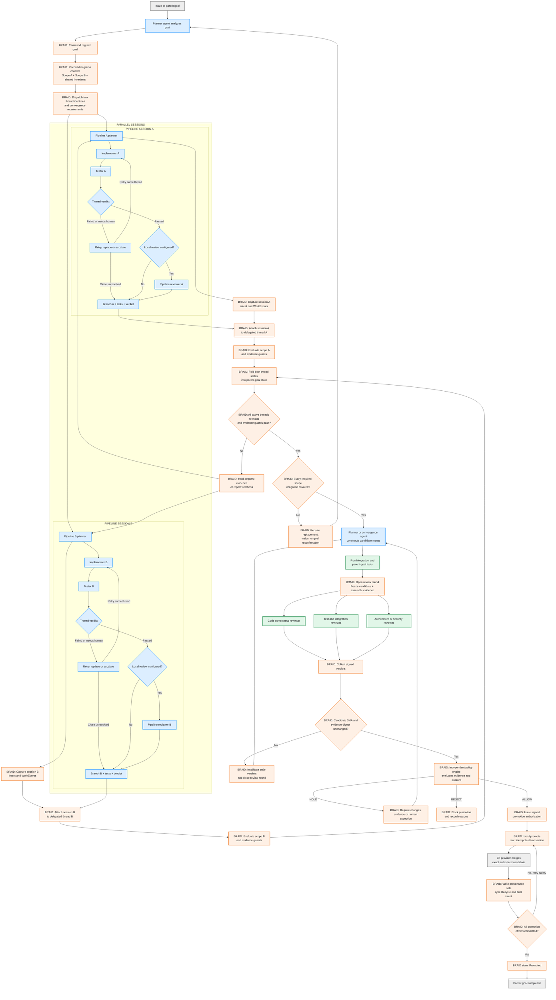

# Braid Two-Pipeline Convergence Flow

## Purpose

This document describes the target Braid flow when one parent goal is split into two independent agentic pipeline sessions.

Braid is the planner's coordination, evidence, and authority substrate. It does not implement the delegated code or independently resolve engineering conflicts. It records the delegation contract, binds sessions to scopes, evaluates lifecycle evidence, collects review verdicts, and controls whether a candidate merge is eligible for promotion.

This is a target design. Individual controls shown below may not yet exist in the current implementation.

## Flow Diagram

Color convention:

- Orange: Braid-owned coordination, evidence, policy, or promotion behavior.
- Blue: planner, worker pipeline, or convergence-agent behavior.
- Green: independent integration, verification, or specialist review.
- Gray: external goal, Git-provider merge, or completed outcome.



## Responsibility Boundaries

### Planner Agent

The planner agent owns the decomposition of the parent goal. It decides:

- Which two scopes should be delegated.
- Why those scopes are expected to be disjoint.
- Which shared invariants both pipelines must preserve.
- What evidence each pipeline must return.
- What conditions define successful convergence.

Braid records and enforces this contract. Braid does not invent the decomposition unless a future planning capability is explicitly added.

### Independent Pipeline Sessions

Each pipeline independently plans and performs its delegated work. A pipeline normally contains an implementer and tester. It may also contain its own local reviewer.

Pipeline-level review is optional unless required by policy. Its purpose is to answer:

```text
Did this pipeline complete its assigned scope correctly?
```

The pipeline returns a branch or equivalent change identity, test evidence, its current verdict, and the WorkEvents captured during the session. A failed or needs-human verdict may resume on the same thread; a replacement thread must preserve explicit lineage to the obligation it supersedes.

### Braid

Braid participates at the coordination and authority boundaries:

1. Register the parent goal.
2. Record the delegation and convergence contract.
3. Assign stable braid and thread identities.
4. Bind each captured session to the correct delegated thread.
5. Preserve intent, decisions, attempts, tool evidence, file evidence, and terminal verdicts as WorkEvents.
6. Evaluate scope and evidence guards.
7. Fold both terminal thread states into parent-goal state.
8. Confirm that every required delegated obligation passed, was replaced, or received an explicit signed waiver or goal reconfirmation.
9. Determine whether the work is eligible to enter convergence review.
10. Open a review round against the exact candidate merge identity.
11. Freeze the candidate and assemble the review evidence bundle.
12. Dispatch or surface the configured reviewer roles.
13. Collect signed reviewer verdicts.
14. Invalidate verdicts if the candidate identity or evidence digest changes.
15. Apply the declared policy and quorum deterministically.
16. Issue, hold, or deny promotion authorization.
17. Execute promotion as an idempotent transaction and record final provenance and intent.

Braid does not write the feature code, decide how to resolve a semantic code conflict, or substitute its own judgment for the declared reviewers.

### Convergence Agent

The planner or a separate convergence agent constructs the candidate merge. This may involve combining branches, resolving conflicts, adapting integration code, and producing a stable candidate for review.

The convergence agent answers:

```text
How should these independently produced changes be combined?
```

The independent policy engine does not construct or repair the candidate merge. It decides whether the resulting candidate is authorized.

### Braid Review Boundary

`braid review` belongs after the convergence agent has constructed the candidate merge and integration evidence is available, but before any reviewer verdict is accepted.

The target review boundary performs the following work:

```text
candidate merge + integration evidence
-> braid review
-> register and freeze candidate identity
-> assemble braid/thread/WorkEvent/test evidence
-> open a review round
-> invoke or surface configured reviewer roles
-> collect verdicts against that exact candidate
```

If the candidate changes after the review round opens, Braid must invalidate or reconfirm the affected verdicts. The current `braid review` command may need additional behavior to implement this complete target boundary; the diagram describes the intended lifecycle responsibility.

### Independent Reviewers

Convergence reviewers inspect the combined candidate, not only the two source branches. Typical roles include:

- Code correctness reviewer.
- Test and integration reviewer.
- Architecture reviewer.
- Security reviewer when the change is security-sensitive.
- Parent-goal verifier.

Reviewers may be agents, humans, or a mixture. The authority may be one required reviewer or a policy-defined quorum.

### Git Provider

The Git provider performs the mechanical merge after Braid issues authorization. Braid remains independent of GitHub, GitLab, Entire, local Git, or another provider through provider adapters.

## Policy Evaluation

The policy engine evaluates facts and signed verdicts. It should not generate new engineering conclusions.

An example policy is:

```text
ALLOW only when:
- every active thread is terminal
- every required delegated obligation passed, was replaced, or has an authorized waiver
- no unresolved scope violation exists
- required evidence is present for both threads
- integration and parent-goal tests passed
- at least 2 of 3 designated code reviewers approved
- every mandatory specialist reviewer approved
- the candidate merge identity matches the reviewed identity
- the evidence digest and policy version match the review authorization
```

Possible outcomes are:

| Outcome | Meaning |
| --- | --- |
| `ALLOW` | The exact reviewed candidate is authorized for merge and promotion. |
| `HOLD` | More work, evidence, review, reconfirmation, or an explicit exception is required. |
| `REJECT` | Promotion is blocked and the reasons are recorded. |

## Review Quorum

A simple quorum such as `2-of-3` refers to designated code-review agents or humans. A stronger role-based policy prevents two general reviewers from overriding a mandatory specialist concern.

Example:

```text
Required:
- 2 of 3 designated code-review approvals
- test/integration reviewer approval
- security reviewer approval when security-sensitive
- parent-goal verifier approval

Optional:
- pipeline-local reviewer approval, unless elevated by policy
- human approval for low-risk changes

Always required for production-sensitive work:
- designated human authority or explicit organizational policy
```

## Core Invariants

The flow depends on the following invariants:

1. The delegation contract is recorded before delegated work is accepted.
2. Each WorkEvent is attributable to a session, thread, actor, and sequence.
3. Session attachment cannot silently move evidence to a different delegated thread.
4. Scope guards consider declared files plus semantic contracts such as APIs, schemas, dependencies, and shared invariants.
5. Every required delegated obligation is covered by a passed thread, an explicit replacement, or a signed waiver or goal reconfirmation.
6. `verify_failed`, `needs_human`, and stale `verify_passed` verdicts can return to working through an explicit new attempt or resolution event.
7. Pipeline-local approval cannot authorize parent-goal promotion by itself.
8. Convergence review evaluates the exact candidate merge that may be promoted.
9. Any change to the candidate or evidence digest after review invalidates or reconfirms affected verdicts.
10. The policy version used for authorization is recorded.
11. The Git provider may merge only the candidate identity authorized by policy.
12. Promotion retries are idempotent across provider merge, provenance-note writing, and lifecycle synchronization.
13. Human override is explicit, signed, attributable, reasoned, and preserved as an exception event.

## Primary Problem Solved

The flow addresses one central question:

> When a planner delegates one goal to independent agentic pipelines, how can it establish that the work remained correctly divided, converged safely, collectively achieved the parent goal, and was accepted by the required authority?

Intent and WorkEvent recording make that answer explainable, auditable, and reconstructable. They support the convergence solution; they are not a replacement for scope contracts, independent verification, quorum policy, or promotion authority.
