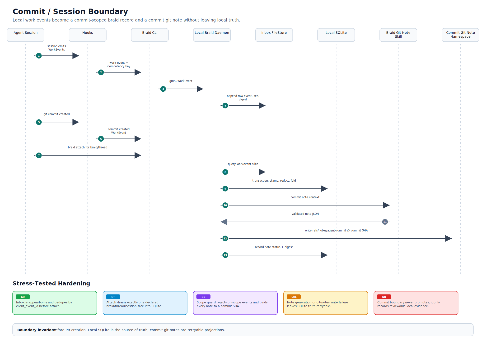
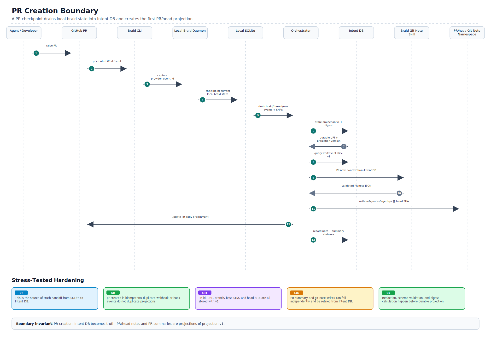
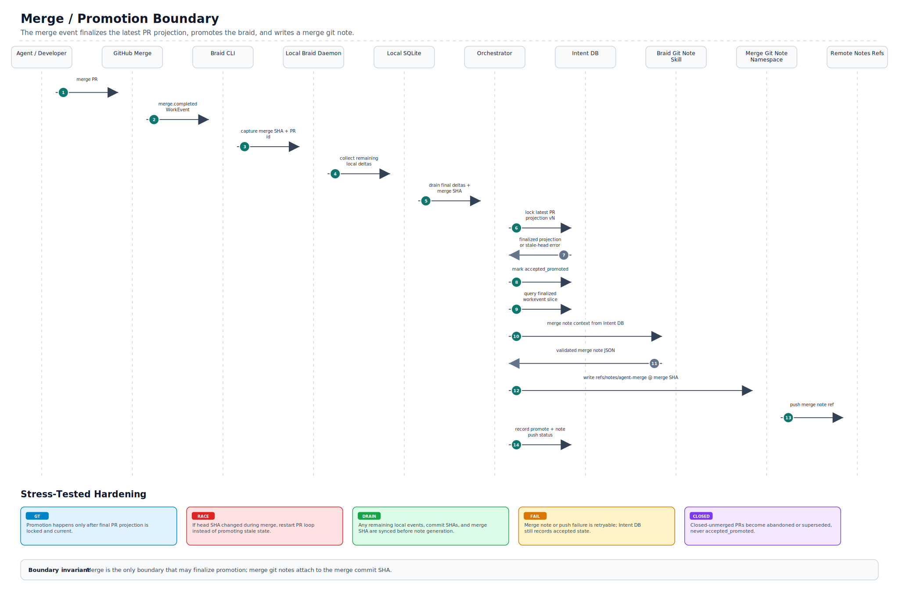

# Braid Work Events Sequence: Current State And Improvements

Generated from the latest sequence diagram:

- SVG: `../assets/braid-work-events/braid-work-events-sequence.svg`
- PR loop SVG: `../assets/braid-work-events/pr-change-loop-sequence.svg`
- Commit/session boundary SVG: `../assets/braid-work-events/commit-boundary-sequence.svg`
- PR creation boundary SVG: `../assets/braid-work-events/pr-creation-boundary-sequence.svg`
- Merge/promotion boundary SVG: `../assets/braid-work-events/merge-boundary-sequence.svg`

## Current State

The diagram now has a coherent lifecycle model across three durable boundaries:

```text
Local session -> Commit boundary -> PR boundary -> Merge boundary
```

The major source-of-truth transition is explicit:

```text
Before PR:
Inbox / Local SQLite are the local source of truth.

At PR:
SQLite drains braid/thread/raw stamped events, Git refs, commit/head SHAs, and PR metadata into Intent DB.

After PR:
Intent DB becomes the source of truth.

At merge:
Remaining PR/merge events plus merge SHA drain into Intent DB; promote status is finalized.
```

## Local Capture

Agent activity is captured as `WorkEvent` records through hooks and Braid CLI.

The local path is:

```text
Agent -> Hooks -> Braid CLI -> Local Braid Daemon -> Inbox
```

The Inbox is the pre-attach local FileStore. It is not the durable braid database; it is the scratch capture area before `braid attach`.

## Commit Boundary



The commit boundary anchors work to a stable Git object.

Current flow:

```text
commit.created
-> event captured into Inbox
-> braid attach queries Inbox workevent slice
-> attach folds into Local SQLite
-> Braid Git Note Skill synthesizes commit note
-> git note written
```

Current namespace:

```text
refs/notes/agent-commit
```

Intended object anchor:

```text
Commit git note -> commit SHA
```

Stress-tested hardening:

```text
duplicate hook event
-> dedupe by client_event_id before attach

agent emits events but never attaches
-> keep in Inbox until explicit attach or cleanup policy

commit is amended / rewritten
-> old commit note remains historical; new commit SHA gets a new projection

note generation fails
-> SQLite remains truth; retry note generation from stored slice

off-scope events appear in Inbox
-> attach rejects them before SQLite fold
```

Commit boundary invariant:

```text
The commit boundary never promotes work.
It only folds local evidence and creates a retryable commit-note projection.
```

## PR Boundary



The PR boundary is the durability boundary.

Current flow:

```text
PR raised
-> pr.created event captured
-> PR checkpoint recorded
-> SQLite drains braid/thread/git refs/raw events into Orchestrator
-> Intent DB stores events, braids, SHAs
-> durable URI + digest returned
-> PR intent generated
-> PR/head git note written
```

Current namespace:

```text
refs/notes/agent-pr
```

Intended object anchor:

```text
PR/head git note -> PR head SHA
```

Important detail: Git notes attach to Git objects, not directly to GitHub PRs. So the PR note should attach to the PR head commit SHA while also recording the PR id / PR URL in the note body and Intent DB.

Stress-tested hardening:

```text
duplicate pr.created webhook / hook event
-> dedupe by provider_event_id and PR id

PR created before all local events are attached
-> create a pending drain; retry until the local braid projection is complete

head SHA changes immediately after PR creation
-> write v1 as historical, then PR change loop creates v2 for the new head SHA

PR summary write fails
-> Intent DB remains truth; summary_status stays pending or failed

PR/head git note write fails
-> note_status stays pending or failed; retry from Intent DB projection
```

PR boundary invariant:

```text
At PR creation, Intent DB becomes the source of truth.
PR/head git notes and PR descriptions are projections of Intent DB, not truth.
```

## PR Change Loop


The current diagram includes a callout for changed intent after PR creation.

Meaning:

```text
Any PR commit, PR body edit, PR comment, review reply, goal change, or scope change
must emit a changed-intent delta into Intent DB before merge.
```

The hardened PR loop treats every change as an append-only delta, then rebuilds the current PR projection from Intent DB.

Required behavior:

```text
dedupe incoming PR events
apply changed-intent deltas through projection versions
record old_head_sha -> new_head_sha for force-push/rebase
keep old PR/head notes historical
regenerate current PR/head note from Intent DB
retry PR summary and git-note writes without blocking Intent DB truth
lock/finalize the latest projection before merge promotion
```

This prevents the PR summary from becoming stale after review activity or follow-up agent/developer changes, while also making webhook retries, out-of-order events, force-pushes, and note-write failures survivable.

## Merge Boundary



The merge boundary finalizes acceptance/promotion.

Current flow:

```text
merge.completed
-> merge event captured
-> final events + merge SHA drained into Intent DB
-> Intent DB queried as source of truth
-> braid marked promoted
-> merge git note synthesized
-> merge git note written
-> notes refs pushed
```

Current namespace:

```text
refs/notes/agent-merge
```

Intended object anchor:

```text
Merge git note -> merge commit SHA
```

Stress-tested hardening:

```text
merge starts while PR change loop is still draining
-> lock / finalize the latest projection version before promotion

merge SHA is missing or delayed
-> hold as merge_pending; do not promote until merge commit SHA exists

head SHA in merge event does not match finalized PR projection
-> reject as stale-head and re-run the PR loop

closed without merge
-> mark abandoned, superseded, or closed_unmerged; never accepted_promoted

merge git note push fails
-> accepted state remains in Intent DB; note push is retryable
```

Merge boundary invariant:

```text
Merge is the only boundary that may finalize promotion.
The merge note attaches to the merge commit SHA and indexes the accepted projection.
```

## Status Model

The lifecycle should distinguish reviewable work from accepted work.

Recommended statuses:

```text
local_active
reviewable_candidate
changed_after_pr
merge_pending
accepted_promoted
abandoned
superseded
closed_unmerged
```

The PR boundary should not be treated as final promotion. It should publish a reviewable candidate. Merge should finalize promotion.

## Improvements To Make The Diagram Implementation-Ready

### 1. Implement PR Change Loop As A Versioned Projection

The diagram now shows the PR change loop as a full sequence. Implementation should preserve these invariants:

```text
Agent / Developer changes PR
-> GitHub PR emits change event
-> Hooks / Braid CLI capture event
-> Local Braid Daemon or Orchestrator records changed-intent delta
-> Intent DB dedupes and applies vN -> vN+1
-> PR/head git note is regenerated from the current projection
```

Changed intent should be a first-class lifecycle object, not a free-form transcript.

### 2. Add Git Object Anchors To Namespace Boxes

Each namespace box should show both namespace and target object:

```text
Commit git note namespace
refs/notes/agent-commit
attaches to: commit SHA

PR/head git note namespace
refs/notes/agent-pr
attaches to: PR head SHA

Merge git note namespace
refs/notes/agent-merge
attaches to: merge commit SHA
```

This avoids ambiguity around PR notes, since Git cannot attach notes directly to a GitHub PR object.

### 3. Define The Intent DB Braid Projection

The PR drain should persist a complete braid projection, not just raw events.

Minimum fields:

```text
braid_id
thread_ids
session_ids
agent ids
work event ranges
raw stamped events
commit SHAs
PR head SHA
base SHA
branch name
PR id / PR URL
scope metadata
status
digest
note refs written
```

Merge-time delta should add:

```text
merge SHA
final head/base SHAs
merged PR id
promote status
merge note ref
updated digest
```

### 4. Make Idempotency And Digests Explicit

Every drain should be safe to retry.

Recommended identifiers:

```text
provider_event_id
braid_id
thread_id
session_id
workevent_seq
commit_sha
pr_id
pr_event_type
previous_head_sha
current_head_sha
merge_sha
projection_version
drain_digest
```

The Orchestrator should be able to reject duplicate drains or merge them deterministically.

### 5. Handle Force-Push / Rebase / PR Revision Cases

PR head SHA can change.

The model should record:

```text
previous_head_sha
new_head_sha
reason: push | force_push | rebase | agent_change | developer_change
changed_intent_delta
```

If the PR head note attaches to a moving head SHA, the previous note remains attached to the older commit. The latest PR projection in Intent DB should point to the current head SHA.

The PR-loop sequence now treats the previous PR/head note as historical and regenerates the current PR/head note against the new head SHA.

### 6. Clarify Note Update Semantics

Decide whether PR/head notes are:

```text
append-only
regenerated with git notes add -f
or written as one note per PR head SHA
```

Recommendation: keep Intent DB append-only, and let PR/head git notes be a compact current projection for the specific head SHA.

Note and PR-summary write failures should not block durable intent. Track:

```text
note_status = pending | written | pushed | failed
summary_status = pending | updated | failed
```

Both can be retried from Intent DB.

### 7. Clarify Ownership Of Note Generation

Current diagram has `Braid Git Note Skill` generating notes.

Implementation should make the boundary clear:

```text
Braid Git Note Skill:
Synthesizes Markdown from provided evidence.

Local Braid Daemon / Orchestrator:
Selects evidence, validates schema, redacts sensitive content, writes git notes, records digest.
```

The model should not decide which Git object receives the note.

### 8. Add Merge Race Guard

Merge should never consume a partially-drained PR change.

Before promotion:

```text
drain final PR-loop delta
lock or finalize the current PR projection
query Intent DB by finalized projection version
mark promoted
write merge git note
```

If a PR changes while merge starts, serialize it through the projection version. Closed-unmerged PRs should transition to:

```text
abandoned
superseded
closed_unmerged
```

They should not become promoted.

### 9. Harden Commit Boundary Retries

The commit boundary needs an explicit retry model because it is still local-first.

Required behavior:

```text
Inbox append is idempotent
braid attach is idempotent by braid_id / thread_id / session_id / event range
commit notes are projections and can be regenerated
amended commits create a new commit-note projection
unattached Inbox events do not enter promotion logic
```

### 10. Harden PR Creation As The Source-Of-Truth Handoff

PR creation should be treated as a checkpoint transaction, not just a notification.

Required behavior:

```text
drain SQLite braid projection into Intent DB
store PR id, PR URL, branch, base SHA, current head SHA, commit SHAs
store raw stamped event ranges and digest
write PR/head git note against head SHA
record PR summary status separately from Intent DB success
```

If the PR is raised twice or the webhook is replayed, the Orchestrator should return the existing projection instead of creating a second one.

### 11. Harden Merge Boundary As Promotion Finalization

Merge is the acceptance boundary and should not rely on local state as truth after the PR has been raised.

Required behavior:

```text
drain any remaining local deltas before finalization
query Intent DB, not SQLite, for merge-note context
verify finalized head/base/merge SHAs
mark accepted_promoted only after the projection lock succeeds
write merge git note against merge commit SHA
record git-note push status separately from promotion status
```

If merge note generation or note push fails, promotion can remain durable in Intent DB while the note write is retried.

## Bottom Line

The latest diagram is strong as a lifecycle architecture. The key remaining step is to turn the PR change loop and git-note anchoring into explicit implementation paths.

The most important invariant is:

```text
Before PR, SQLite is truth.
After PR, Intent DB is truth.
Git SHAs are the join keys between Git history, git notes, raw work events, and braid lifecycle state.
```
