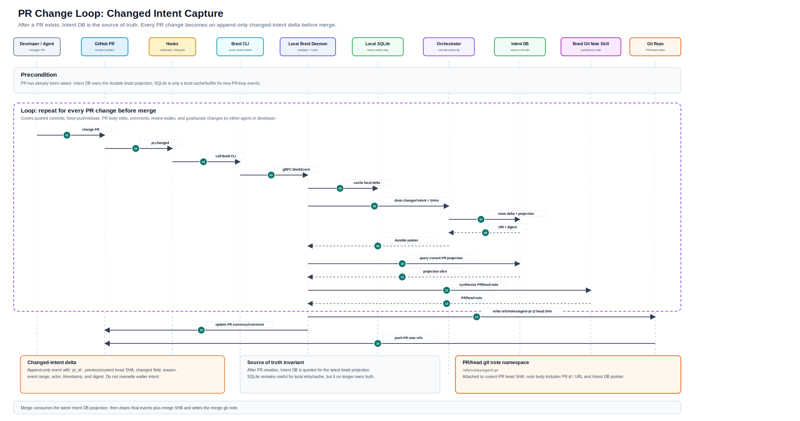

# Braid Work Events Sequence: Current State And Improvements

Generated from the latest sequence diagram:

- SVG: `../assets/braid-work-events/braid-work-events-sequence.svg`
- PR loop SVG: `../assets/braid-work-events/pr-change-loop-sequence.svg`

## Current State

The diagram now has a coherent lifecycle model across three durable boundaries:

```text
Local session -> Commit boundary -> PR boundary -> Merge boundary
```

The major source-of-truth transition is explicit:

```text
Before PR:
Inbox / Local SQLite are the local source of truth.

At PR:
SQLite drains braid/thread/raw stamped events, Git refs, commit/head SHAs, and PR metadata into Intent DB.

After PR:
Intent DB becomes the source of truth.

At merge:
Remaining PR/merge events plus merge SHA drain into Intent DB; promote status is finalized.
```

## Local Capture

Agent activity is captured as `WorkEvent` records through hooks and Braid CLI.

The local path is:

```text
Agent -> Hooks -> Braid CLI -> Local Braid Daemon -> Inbox
```

The Inbox is the pre-attach local FileStore. It is not the durable braid database; it is the scratch capture area before `braid attach`.

## Commit Boundary

The commit boundary anchors work to a stable Git object.

Current flow:

```text
commit.created
-> event captured into Inbox
-> braid attach queries Inbox workevent slice
-> attach folds into Local SQLite
-> Braid Git Note Skill synthesizes commit note
-> git note written
```

Current namespace:

```text
refs/notes/agent-commit
```

Intended object anchor:

```text
Commit git note -> commit SHA
```

## PR Boundary

The PR boundary is the durability boundary.

Current flow:

```text
PR raised
-> pr.created event captured
-> PR checkpoint recorded
-> SQLite drains braid/thread/git refs/raw events into Orchestrator
-> Intent DB stores events, braids, SHAs
-> durable URI + digest returned
-> PR intent generated
-> PR/head git note written
```

Current namespace:

```text
refs/notes/agent-pr
```

Intended object anchor:

```text
PR/head git note -> PR head SHA
```

Important detail: Git notes attach to Git objects, not directly to GitHub PRs. So the PR note should attach to the PR head commit SHA while also recording the PR id / PR URL in the note body and Intent DB.

## PR Change Loop



The current diagram includes a callout for changed intent after PR creation.

Meaning:

```text
Any PR commit, PR body edit, PR comment, review reply, goal change, or scope change
must emit a changed-intent delta into Intent DB before merge.
```

This prevents the PR summary from becoming stale after review activity or follow-up agent/developer changes.

## Merge Boundary

The merge boundary finalizes acceptance/promotion.

Current flow:

```text
merge.completed
-> merge event captured
-> final events + merge SHA drained into Intent DB
-> Intent DB queried as source of truth
-> braid marked promoted
-> merge git note synthesized
-> merge git note written
-> notes refs pushed
```

Current namespace:

```text
refs/notes/agent-merge
```

Intended object anchor:

```text
Merge git note -> merge commit SHA
```

## Status Model

The lifecycle should distinguish reviewable work from accepted work.

Recommended statuses:

```text
local_active
reviewable_candidate
changed_after_pr
accepted_promoted
abandoned
superseded
```

The PR boundary should not be treated as final promotion. It should publish a reviewable candidate. Merge should finalize promotion.

## Improvements To Make The Diagram Implementation-Ready

### 1. Make PR Change Loop A Full Sequence

The current diagram has the PR change loop as a callout. For an implementation spec, make it explicit:

```text
Agent / Developer changes PR
-> GitHub PR emits change event
-> Hooks / Braid CLI capture event
-> Local Braid Daemon or Orchestrator records changed-intent delta
-> Intent DB updates braid projection
-> PR/head git note is appended or regenerated
```

This makes changed intent a first-class lifecycle behavior instead of an annotation.

### 2. Add Git Object Anchors To Namespace Boxes

Each namespace box should show both namespace and target object:

```text
Commit git note namespace
refs/notes/agent-commit
attaches to: commit SHA

PR/head git note namespace
refs/notes/agent-pr
attaches to: PR head SHA

Merge git note namespace
refs/notes/agent-merge
attaches to: merge commit SHA
```

This avoids ambiguity around PR notes, since Git cannot attach notes directly to a GitHub PR object.

### 3. Define The Intent DB Braid Projection

The PR drain should persist a complete braid projection, not just raw events.

Minimum fields:

```text
braid_id
thread_ids
session_ids
agent ids
work event ranges
raw stamped events
commit SHAs
PR head SHA
base SHA
branch name
PR id / PR URL
scope metadata
status
digest
note refs written
```

Merge-time delta should add:

```text
merge SHA
final head/base SHAs
merged PR id
promote status
merge note ref
updated digest
```

### 4. Make Idempotency And Digests Explicit

Every drain should be safe to retry.

Recommended identifiers:

```text
braid_id
thread_id
session_id
workevent_seq
commit_sha
pr_id
merge_sha
drain_digest
```

The Orchestrator should be able to reject duplicate drains or merge them deterministically.

### 5. Handle Force-Push / Rebase / PR Revision Cases

PR head SHA can change.

The model should record:

```text
previous_head_sha
new_head_sha
reason: push | force_push | rebase | agent_change | developer_change
changed_intent_delta
```

If the PR head note attaches to a moving head SHA, the previous note remains attached to the older commit. The latest PR projection in Intent DB should point to the current head SHA.

### 6. Clarify Note Update Semantics

Decide whether PR/head notes are:

```text
append-only
regenerated with git notes add -f
or written as one note per PR head SHA
```

Recommendation: keep Intent DB append-only, and let PR/head git notes be a compact current projection for the specific head SHA.

### 7. Clarify Ownership Of Note Generation

Current diagram has `Braid Git Note Skill` generating notes.

Implementation should make the boundary clear:

```text
Braid Git Note Skill:
Synthesizes Markdown from provided evidence.

Local Braid Daemon / Orchestrator:
Selects evidence, validates schema, redacts sensitive content, writes git notes, records digest.
```

The model should not decide which Git object receives the note.

## Bottom Line

The latest diagram is strong as a lifecycle architecture. The key remaining step is to turn the PR change loop and git-note anchoring into explicit implementation paths.

The most important invariant is:

```text
Before PR, SQLite is truth.
After PR, Intent DB is truth.
Git SHAs are the join keys between Git history, git notes, raw work events, and braid lifecycle state.
```
