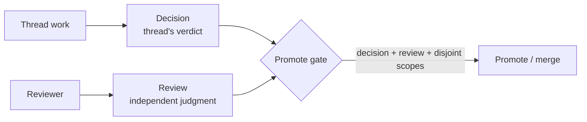

# Reviews

A review is a judgment on work — and review is itself work. A reviewer emits a
`Review` event that says what was examined and what verdict they reached, and
that event becomes part of the same signed stream as the work it judges.

## What a review can examine

A `Review` names one or more **subjects**. A subject has a kind and an id, so a
single review can vouch for things at different granularities:

| Subject kind | Example |
| --- | --- |
| `EVENT` | Review one specific `WorkEvent`, usually for precise audit or investigation. |
| `THREAD` | Approve one thread's final artifact. |
| `CONTRIBUTOR` | Review all work by a specific agent session. |
| `COMMIT` | Approve a specific git commit. |
| `BRAID` | Approve the coordinated work as a whole. |

This is what lets a reviewer say "I vouch for everything this agent session did"
or "I approve this commit" rather than only "I approve the PR." Event-level
reviews are the narrow case: useful when a reviewer wants to vouch for, or call
out, one exact prompt, tool use, decision, or other recorded action.

## Review versus decision

A [decision](decisions.md) is the *thread's own* terminal verdict — the
contributor working the thread says whether it passed. A **review** is an
*independent* judgment by someone vouching for the work. The promote gate wants
both: a thread that decided it passed, and a reviewer who agrees.

## In the flow

During promotion the orchestrator's gate checks the decisions, the review, and
that thread scopes are disjoint before it merges and signs a braid-level
provenance note. Walk through it in
[Review and promote](../stories/review-and-promote.md).

## Related

- [Decisions](decisions.md) — the thread's terminal verdict.
- [Payload Kinds](../reference/payload-kinds.md) — the `Review` payload.
