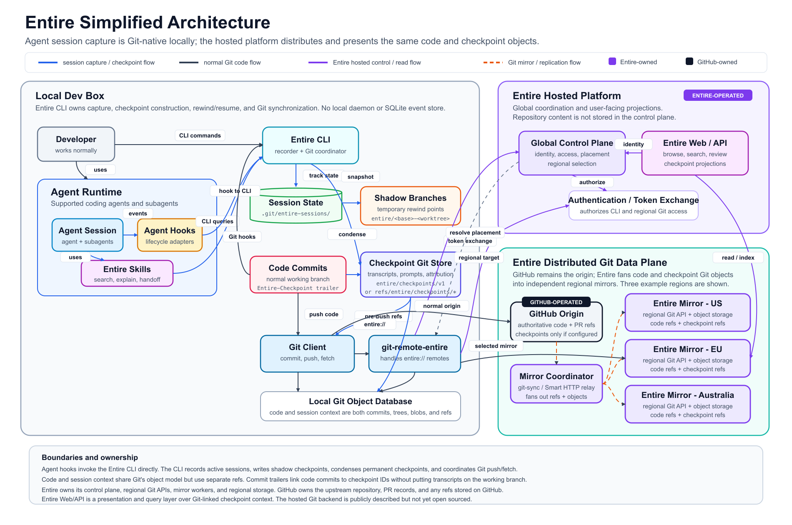

# Entire Architecture

Entire is a Git-native system for capturing, storing, distributing, and presenting the context produced by coding-agent sessions. Its central architectural choice is to represent both source code and agent-session checkpoints using Git objects, while keeping them in separate refs and giving them different lifecycle semantics.

The architecture spans three environments:

1. The developer's local machine, where agent activity is captured and converted into Git-backed checkpoints.
2. Entire's hosted platform, which handles identity, placement, discovery, search, and review projections.
3. A distributed Git data plane, where GitHub remains the upstream code origin and Entire operates regional mirrors for code and checkpoint objects.

## Architecture Diagram

The complete component architecture is embedded below. It shows the local developer environment, Entire-operated hosted services, the GitHub-owned origin, and Entire's regional Git mirror plane.

Downloads: [Vector SVG](assets/entire/entire-simplified-architecture.svg) | [Full-resolution PNG](assets/entire/entire-simplified-architecture.png)

## 1. Local Dev Box

The local development environment is where Entire observes agent work and constructs session history. There is no separate local event daemon or SQLite event store in this design. The Entire CLI coordinates capture and persistence directly through Git.

### Developer and agent runtime

The developer works through a supported coding-agent runtime. A session can include the primary agent and any subagents it starts. Agent lifecycle hooks observe relevant activity and invoke the Entire CLI, while Entire skills let the agent search, explain, and hand off previously captured work.

### Entire CLI

The Entire CLI is both the local recorder and the Git coordinator. It:

- receives lifecycle information from agent hooks;
- tracks active session state;
- creates temporary rewind points;
- condenses completed session context into permanent checkpoints;
- associates code commits with checkpoint identifiers;
- coordinates Git push, fetch, authentication, and remote placement.

### Session state and shadow branches

Active session metadata is maintained under `.git/entire-sessions/`. During a session, Entire creates shadow branches such as `entire/<base>-<worktree>`. These branches preserve temporary snapshots that support rewind and resume without modifying the developer's normal working branch.

### Code commits and checkpoint storage

Entire separates two kinds of Git history:

- **Code commits** remain on the normal working branch.
- **Checkpoint commits** contain prompts, transcripts, attribution, and related agent-session context.

The permanent checkpoint store uses dedicated refs such as `entire/checkpoints/v1` or `refs/entire/checkpoints/*`. A code commit can carry an `Entire-Checkpoint` trailer that links it to its corresponding checkpoint without placing the transcript directly on the code branch.

Both forms of data ultimately reside in the local Git object database as commits, trees, blobs, and refs. The separation is therefore logical and lifecycle-based rather than a split between Git and a second storage technology.

## 2. Git Transport

Normal source-code synchronization follows the repository's ordinary Git remote path. In the illustrated configuration, code is pushed to the GitHub origin.

Entire checkpoint refs can be routed through `git-remote-entire`, which handles `entire://` remotes. Before transfer, the CLI obtains authorization and asks Entire's control plane to resolve the appropriate regional target. The checkpoint objects can then be sent to a selected Entire mirror while remaining linked to the associated code history.

This creates two related flows:

- **Normal Git code flow:** working branch to Git client to GitHub origin.
- **Entire checkpoint flow:** agent hooks to Entire CLI to checkpoint refs to `git-remote-entire` and a regional Entire mirror.

## 3. Entire Hosted Platform

The hosted platform is the control and presentation layer. It is not shown as the primary repository-content store.

### Global control plane

The control plane manages:

- identity and access;
- authorization of CLI and regional Git operations;
- placement and regional selection;
- resolution of the mirror endpoint used by an `entire://` remote.

### Authentication and token exchange

The CLI exchanges credentials or tokens with the hosted platform before accessing Entire-operated Git infrastructure. The resulting authorization applies to the chosen regional Git endpoint.

### Entire Web and API

The Web/API layer provides user-facing projections over the captured Git-linked context, including browsing, search, review, and checkpoint inspection. It reads or indexes information from the distributed data plane rather than replacing Git as the underlying representation.

## 4. Distributed Git Data Plane

The distributed data plane contains GitHub and Entire-operated infrastructure, with a clear ownership distinction.

### GitHub origin

GitHub owns and operates the upstream repository, pull-request records, and authoritative code refs. Checkpoint refs may also be stored on GitHub when explicitly configured, but that is separate from the regional Entire mirror path.

### Mirror coordinator

Entire's mirror coordinator uses Git synchronization and Smart HTTP relay behavior to move refs and objects from the upstream repository into Entire's regional infrastructure. It fans out both code refs and checkpoint refs.

### Regional mirrors

The diagram shows representative mirrors in the United States, Europe, and Australia. Each mirror combines a regional Git API with object storage and can hold:

- mirrored code refs and objects;
- Entire checkpoint refs and objects;
- the Git relationships needed to connect session context to source history.

The mirrors provide regional access and redundancy while GitHub remains the upstream origin in this architecture.

## End-to-End Flow

1. A developer starts or continues work through an agent runtime.
2. Agent hooks send lifecycle activity to the Entire CLI.
3. The CLI tracks the active session and creates shadow snapshots for rewind and resume.
4. The agent produces normal code commits on the working branch.
5. Entire condenses session material into permanent checkpoint Git objects and refs.
6. An `Entire-Checkpoint` trailer links a code commit to the corresponding checkpoint.
7. Normal code is pushed to GitHub through the standard Git remote.
8. Checkpoint refs are routed through `git-remote-entire` when an `entire://` remote is used.
9. Entire's control plane authenticates the client and selects a regional mirror.
10. The mirror coordinator replicates Git refs and objects across Entire-operated regions.
11. Entire Web/API indexes and presents the checkpoint context for search, review, and inspection.

## Ownership Summary

| Area | Owner | Responsibility |
|---|---|---|
| Agent hooks, skills, and CLI behavior | Entire tooling on the local machine | Capture agent activity and construct Git-backed checkpoints |
| Local Git object database | Developer's local Git repository | Store code and checkpoint objects before synchronization |
| Global control plane and Web/API | Entire | Identity, authorization, placement, search, review, and projections |
| Regional Git APIs, mirror workers, and storage | Entire | Distribute and serve mirrored code and checkpoint objects |
| Upstream repository and pull requests | GitHub | Authoritative code refs, repository hosting, and PR lifecycle |

## Architectural Implications

- **Git is the common storage model.** Entire does not require a separate local event database to preserve session context.
- **Code and context remain separable.** They share Git's object model but live under different refs and can follow different synchronization policies.
- **Checkpoint identity is durable.** Commit trailers provide an explicit link from code history to the session checkpoint that produced it.
- **The hosted service is both control plane and projection layer.** It authorizes access, resolves placement, and makes checkpoint history searchable and reviewable.
- **The regional layer is a Git data plane.** Entire operates mirrors and storage, while GitHub can remain the authoritative upstream code host.

## Current Boundary

The diagram reflects Entire's publicly described architecture and the inspected CLI-oriented design. Entire's hosted Git backend is represented at the component and responsibility level; its internal implementation is not assumed beyond the publicly visible control-plane, synchronization, and regional-mirror behavior.
