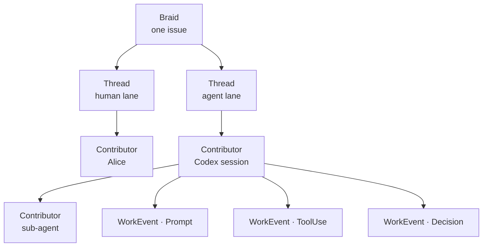

# Concepts at a Glance

The whole Braid vocabulary on one page. Each term links to its full concept
page.

| Term | One-line definition |
| --- | --- |
| [Braid](../concepts/braids.md) | One coordinated unit of work, such as a GitHub issue. Contains one or more threads. |
| [Thread](../concepts/threads.md) | One lane of work inside a braid, usually with a declared scope. |
| [Contributor](../concepts/contributors.md) | One human or agent *session* acting inside a thread. Session-shaped, not just identity-shaped. |
| [Event](../concepts/events.md) | One recorded action by one contributor — a signed `WorkEvent` with exactly one payload kind. |
| [Review](../concepts/reviews.md) | A judgment on an event, thread, contributor, braid, or commit. Review is itself work. |
| [Decision](../concepts/decisions.md) | A thread's terminal verdict: passed, failed, needs human attention, or aborted. |

## How they nest

## The shape of the protocol

- Work is recorded as a stream of signed [`WorkEvent`](../protocol/work-event.md)
  messages.
- Every event names its **contributor**, **thread**, **time**,
  **capture method**, and exactly one **payload kind**.
- Events are signed with **Ed25519** over the canonical event bytes, so the
  record is tamper-evident. See [Capture & Provenance](../protocol/capture-and-provenance.md).
- The **orchestrator** assembles thread artifacts, runs the promote gate, and
  computes touched files from git — it never trusts a client to report what
  changed.

## Two rules worth remembering early

1. **Sessions, not just identities.** Two Codex sessions in the same thread are
   two contributors. A parent agent spawns a sub-agent by setting
   `spawned_by_contributor_id`.
2. **Git is the source of truth for *what changed*.** The protocol records
   intent, reasoning, and verdicts; the orchestrator derives the diff from git
   commit state, not from event payloads.

Ready for the wire contract? Continue to the
[Protocol overview](../protocol/overview.md).
