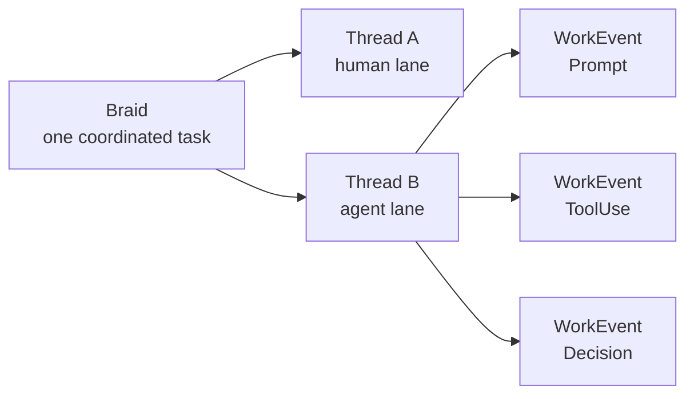

# Introduction

Braid coordinates software work across humans and agents by recording what
happened, who did it, what shaped the work, and what was vouched for.

As more code is written by agents — and by humans working alongside them — the
hard question stops being *"what changed?"* and becomes *"who is accountable for
this change, and what did they actually consider?"* Git answers the first
question well. Braid answers the second.

## Why Braid exists

A modern change to a codebase is rarely one person typing. It is a human
claiming an issue, an agent receiving a scoped prompt, tools running, files
being read, sub-agents being delegated to, and finally a reviewer vouching for
the result. Most of that context is lost the moment the pull request merges.

Braid keeps that context as a stream of signed events, so that for any unit of
work you can answer:

- Who worked on this — which humans and which agent sessions?
- What did they consider before acting?
- What changed in git, and which events led to it?
- Who reviewed the work and vouched for it?

## What Braid does

Braid records work as a stream of signed [`WorkEvent`](../protocol/work-event.md)
messages. Each event names the contributor that acted, the thread it belongs to,
when it happened, how it was captured, and exactly one payload kind.

The model has three levels:

- **[Braid](../concepts/braids.md)** — one unit of coordinated work, such as one
  issue.
- **[Thread](../concepts/threads.md)** — one lane inside a braid, usually tied to
  a scope or pull request.
- **[Event](../concepts/events.md)** — one recorded action by one contributor
  inside a thread.

## Where to go next

-   __Quickstart__

    ---

    Walk through a first braid end to end — claim, work, commit, decide.

    [:octicons-arrow-right-24: Quickstart](quickstart.md)

-   __Concepts at a glance__

    ---

    The whole vocabulary on one page before you dive into the protocol.

    [:octicons-arrow-right-24: Concepts at a glance](concepts-at-a-glance.md)

-   __Protocol overview__

    ---

    The three-level model and how the wire contract is structured.

    [:octicons-arrow-right-24: Protocol overview](../protocol/overview.md)

!!! info "Source of truth"
    The proto is the canonical wire contract:
    [`work.proto`](https://github.com/braidkit/Prototype/blob/main/api/proto/braid/work/v1/work.proto).
    These docs explain the model; they do not invent protocol facts.
