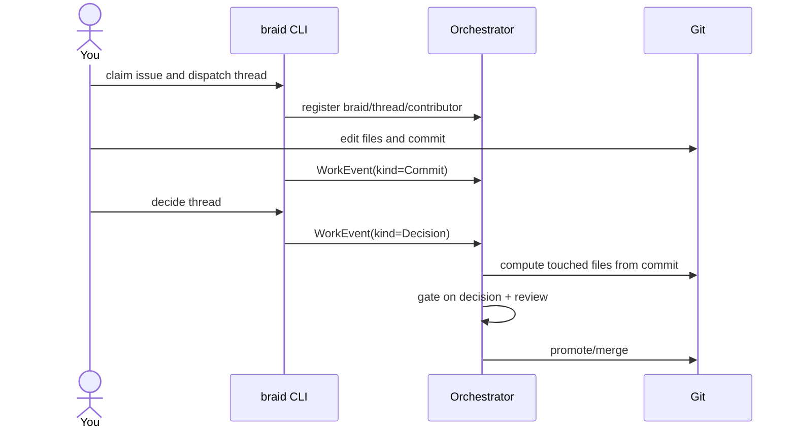

# Quickstart

This page walks through the shape of a first braid — from claiming an issue to a
terminal decision — so you can see which events get emitted and why.

!!! warning "Illustrative commands"
    The `braid` CLI invocations below show the *flow*, not a frozen command
    spec. Exact flags, subcommands, and configuration live in the
    [Prototype repository](https://github.com/braidkit/Prototype). When the two
    disagree, the Prototype repo wins. The event sequence, however, mirrors the
    [Human thread](../stories/human-thread.md) walkthrough and is the part worth
    internalizing.

## 1. Claim work and dispatch a thread

A [braid](../concepts/braids.md) is created for a unit of coordinated work — for
example, one GitHub issue. You claim it and dispatch a
[thread](../concepts/threads.md) to work in:

```sh
# Illustrative
braid claim issue-1423
braid thread dispatch --scope "api/payments/**"
```

This registers the braid, the thread, and you as a
[contributor](../concepts/contributors.md) with the orchestrator. No
`WorkEvent` payload is needed yet — the thread already exists from dispatch.

## 2. Do the work and commit

Edit files and commit as you normally would. Braid observes the commit and emits
a `Commit` event so it can point at the exact git object that stores the diff:

```sh
# Illustrative
git commit -am "Add idempotency key to charge endpoint"
```

| What happens | Event sent |
| --- | --- |
| You commit | `Commit` |

## 3. Record the outcome

When the thread is done, you record a terminal
[decision](../concepts/decisions.md). The decision gives the promote gate a
verdict — it is *not* trusted to report which files changed; the orchestrator
computes touched files from git commit state.

```sh
# Illustrative
braid thread decide --verdict pass --reason "Endpoint is idempotent and tested"
```

| What happens | Event sent |
| --- | --- |
| You mark the thread complete | `Decision` |

## 4. Review and promote

A reviewer examines the thread artifact and emits a
[`Review`](../concepts/reviews.md) event vouching for it. The orchestrator's
promote gate checks the decision, the review, and that thread scopes are
disjoint before merging. See [Review and promote](../stories/review-and-promote.md).

## The full picture



## Next steps

- See an agent do the same thing in the [Agent thread](../stories/agent-thread.md)
  walkthrough — it adds `AgentStart`, `Prompt`, `IntentDeclaration`,
  `ToolUse`, `ContextSnapshot`, and `AgentEnd` events.
- Read the [WorkEvent reference](../protocol/work-event.md) for the full event
  envelope and every payload kind.
