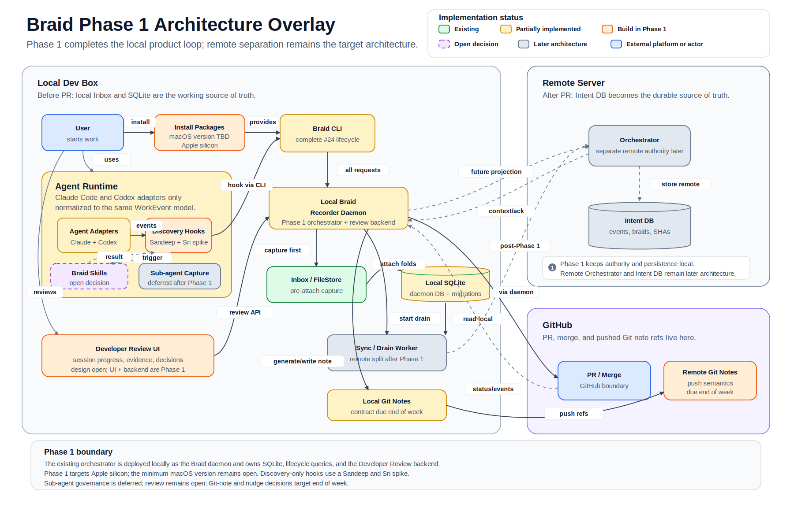

# Braid Phase 1 Scope

**Status:** Draft

**Scope owner:** Product/design decision

**Lifecycle reference:** [Braid issue #24](https://github.com/braidkit/braid/issues/24)

**PDF:** [Download the Phase 1 scope](assets/phase-1/braid-phase-1-scope.pdf)

## Phase 1 Outcome

A developer can install Braid, use it with Claude Code or Codex, run the complete Braid lifecycle, observe the progress of independent agent sessions, review the converged result, and promote it with durable Git-note provenance.

## Architecture Overlay

The target architecture below is colored by implementation status. Green components already provide the required foundation. Yellow components are partially implemented and require Phase 1 completion, while orange components still need to be built. Purple dashed components remain open product decisions, and gray components belong to the later remote architecture.



## Phase 1 Boundary

- The existing orchestrator is deployed locally as the **Braid daemon**.
- The daemon owns local SQLite, lifecycle queries, and the Developer Review backend.
- Phase 1 completes Claude Code and Codex support.
- Phase 1 completes the issue #24 lifecycle command surface.
- Phase 1 provides installation packages for the selected platforms.
- Phase 1 provides the Developer Review UI and its backend service.
- Phase 1 generates and pushes Git notes.
- The following remain explicit product decisions within Phase 1 planning:
  - Claude Code and Codex hooks
  - Braid Skills
  - Supported platform coverage
  - Git-note format and publication policy
  - Developer Review workflow and design
  - Nudges
- The separate remote Orchestrator, Intent DB, and sync/drain architecture are deferred until after Phase 1.

## Explicitly Outside Phase 1

The following target-architecture capabilities are not included in the Phase 1 release:

- Separate remote Orchestrator service
- Remote Intent DB
- Local-to-remote sync/drain worker
- PR-boundary event and braid draining
- Merge-boundary incremental draining
- Remote authority and policy enforcement
- Centralized storage of events, braids, commit SHAs, PR identifiers, and merge SHAs
- Multi-machine or organization-wide intent retrieval
- Remote lifecycle projections
- Agent integrations beyond Claude Code and Codex
- Distributed or server-managed nudges
- Full Git-provider integrations beyond pushing Git-note refs
- Production-scale multi-user identity, tenancy, and access control
- Remote durability, availability, backup, and disaster recovery
- Separation of the local recorder daemon from the orchestrator
- Cross-repository and asynchronous multi-pipeline convergence infrastructure

Hooks, supported platforms, Git-note policy, Developer Review design, Braid Skills, and nudges are not automatically outside Phase 1. Their inclusion is determined by the open Phase 1 product decisions.

## 1. Existing Foundation

Phase 1 starts with the components already implemented in the codebase, including:

- Braid CLI and the existing lifecycle commands
- Local inbox and WorkEvent capture
- Discovery and intentional attach paths
- Braid and thread state folding
- Scope checks
- Verification and review events
- Existing promotion behavior
- Orchestrator gRPC service and SQLite storage
- Claude adapter
- Codex adapter, after it is merged and hardened

## 2. Installation Experience

Phase 1 must provide an installable product rather than requiring developers to build Braid from source.

Required work:

- Select the supported operating systems and architectures.
- Build distributable packages for every supported platform.
- Install and configure the Braid CLI.
- Install and configure the Phase 1 Braid daemon.
- Install any required Claude Code and Codex integrations.
- Provide version, diagnostics, upgrade, and uninstall behavior.

**Open decision:** Supported platform and architecture matrix.

## 3. Agent Support

Phase 1 supports only:

- Claude Code
- Codex

Both adapters must produce the same normalized WorkEvent model and lifecycle behavior.

**Open decision:** Whether Claude Code and Codex hooks are required for Phase 1.

The hook decision affects:

- Automatic event capture
- Timely session-state updates
- Nudges
- Automatic wrap and attach assistance
- Detection of changed intent

## 4. Complete Braid Lifecycle

Phase 1 must implement the complete command and state-transition contract defined by [issue #24](https://github.com/braidkit/braid/issues/24).

### Present Or Substantially Present

- `braid init`
- `braid claim` / `braid open`
- `braid dispatch`
- `braid wrap`
- `braid attach`
- `braid status`
- `braid show`
- `braid verify`
- `braid review`
- `braid promote`

### Missing Or Incomplete

- Canonical `braid start` naming
- Thread drop
- `braid reconfirm-goal`
- `braid dismiss`
- `braid abort`
- Functional `braid replay`
- Approval command naming and semantics
- Automatic review-boundary behavior
- Review and session progress reporting

Before implementation is finalized, issue #24 and the code must agree on exactly when a braid becomes `surfaced`: automatically after all gates pass, or only after an approval decision.

## 5. Phase 1 Braid Daemon

For Phase 1, the orchestrator is the Braid daemon.

```text
Braid CLI
    |
    v
Local Braid daemon
    |
    +-- SQLite
    +-- Lifecycle and query services
    +-- Developer Review backend
    +-- Git-note generation and push coordination
```

Required daemon work:

- Local service startup and shutdown
- Default local endpoint discovery
- Stable SQLite location and schema migrations
- Crash recovery
- Logging and diagnostics
- Session and braid query APIs
- Developer Review backend APIs

This is a Phase 1 deployment simplification. It does not prevent the local daemon and remote orchestrator from being separated later.

## 6. Review Progress

The `braid review` command surface must show the current state of the participating sessions.

The status should include:

- Braid and thread IDs
- Agent runtime
- Declared scope
- Current lifecycle state
- Last received event and activity time
- Verification verdict
- Scope violations
- Pending goal reconfirmation
- Review status
- Promotion readiness

Progress should be based on factual lifecycle state and outstanding gates. Phase 1 should not present an invented percentage-complete indicator.

## 7. Developer Review UI

Phase 1 includes both parts of the Developer Review experience:

- The Developer Review UI
- The backend service used by the UI

The backend service will be hosted by the Phase 1 Braid daemon.

The review experience should support:

- Braid and thread progress
- Scope and collision inspection
- Event and intent timeline
- Verification evidence
- Outstanding gates and guards
- Review decisions
- Promotion readiness
- Durable approval or refusal recording

**Open decision:** Final Developer Review workflow and UI design.

## 8. Git Notes

Phase 1 must generate and push the Git note. Writing the note only to a local Git repository is not sufficient.

The Git-note design must settle:

- Note namespace
- Commit or merge object that receives the note
- Markdown or structured schema
- Intent, evidence, and review contents
- Signature and identity representation
- Redaction rules
- Replacement and versioning behavior
- Remote and refspec
- Push and retry behavior
- Whether failed note publication blocks promotion

**Open decision:** Final Git-note contract and publication policy.

## 9. Nudges

Phase 1 must decide which lifecycle conditions should produce developer or agent nudges.

Candidate conditions include:

- Session completed but not wrapped
- Wrapped work waiting for attach
- Missing terminal verdict
- Scope violation
- Stale session
- Goal reconfirmation required
- Review boundary reached
- Promotion ready
- Git-note push failed

**Open decision:** Nudge conditions, channels, timing, recipients, and whether any nudges are blocking.

## Open Decision Order

The unresolved decisions should be made in this order because later decisions depend on earlier ones:

1. Freeze the issue #24 command and state-transition contract.
2. Choose the supported platform matrix.
3. Decide whether hooks are required.
4. Finalize the review workflow and authority model.
5. Finalize the Git-note format and push semantics.
6. Decide the nudge model.
7. Freeze the Developer Review UI design.

The hook decision should be made before finalizing nudges and the Review UI backend because hooks determine how quickly and reliably live session progress enters Braid.
