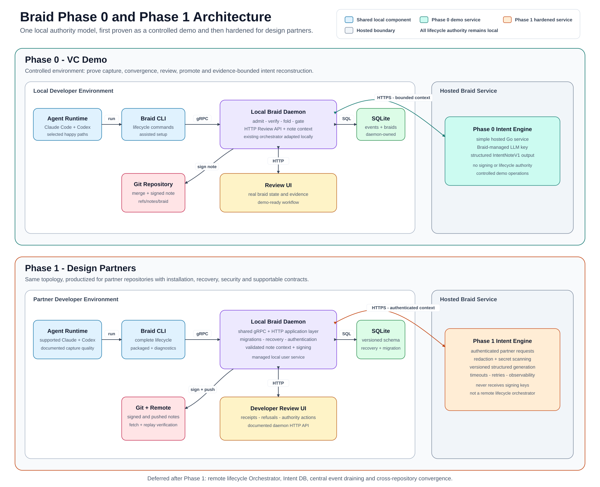

# Braid Phase 0 and Phase 1 Scope

**Status:** Draft

**Scope owner:** Product/design decision

**Lifecycle reference:** [Braid issue #24](https://github.com/braidkit/braid/issues/24)

**PDF:** [Download the Phase 0 and Phase 1 scope](assets/phase-1/braid-phase-1-scope.pdf)

## Delivery Model

Braid reaches the market in two steps:

- **Phase 0 - VC Demo:** prove the complete Braid story in a controlled developer environment with real agent sessions, real lifecycle evidence, a working Review UI, and an agent-generated intent note.
- **Phase 1 - Design Partners:** turn the demonstrated loop into an installable, supportable product that design partners can use on their own repositories and day-to-day work.

Phase 0 and Phase 1 use the same fundamental topology. Phase 1 hardens the
components, contracts, security, recovery, and installation experience rather
than replacing the Phase 0 architecture.

## Architecture

The local Braid daemon remains the lifecycle authority in both phases. It owns
SQLite, serves gRPC to the Braid CLI, and serves HTTP to the Review UI. A
separate hosted Intent Engine performs evidence-bounded LLM synthesis using a
Braid-managed model key. It does not directly mutate lifecycle state, sign
records, or write Git notes.

## Boundary Summary

| Area | Phase 0 - VC Demo | Phase 1 - Design Partners |
|---|---|---|
| Goal | Prove the complete product story | Deliver repeatable partner value |
| Environment | Controlled Braid-operated setup | Partner developer machines and repositories |
| Installation | Scripted or assisted setup | Packaged install, diagnostics, upgrade and uninstall |
| Agent support | Selected Claude Code and Codex happy paths | Supported and tested Claude Code and Codex integration |
| Lifecycle | Demonstrable happy paths | Complete issue #24 contract and failure behavior |
| Daemon | Local orchestrator adapted as daemon | Managed local service with recovery and migrations |
| Review UI | Demo-ready review and promotion flow | Productized workflow with complete state and refusal handling |
| Intent Engine | Simple hosted Go service using Braid's LLM key | Authenticated, redacted, observable and failure-tolerant service |
| Git note | Evidence-bounded generated note for the demo | Versioned, validated, signed, pushed and replay-verifiable note |
| Operations | Braid team operates and repairs | Design partner can diagnose and recover |

# Phase 0 - VC Demo

## Phase 0 Outcome

A developer can run two meaningful agent sessions against one parent goal,
capture their evidence, attach them to a braid, inspect convergence in the
Review UI, make a review decision, promote the accepted result, and inspect a
Git note that reconstructs the intent and evidence behind the promoted work.

The Phase 0 demo must use real Braid commands, real SQLite state, real agent
output, and a real Git repository. Fixture-only screens and hand-authored notes
do not satisfy the demo boundary.

## Phase 0 Architecture

### Local Developer Environment

- **Braid CLI**
  - Drives the demonstrated lifecycle.
  - Talks to the local daemon over gRPC.
  - Starts or coordinates the selected Claude Code and Codex sessions.
- **Local Braid daemon**
  - Reuses the existing orchestrator process.
  - Owns event admission, signature verification, folding, gates and lifecycle state.
  - Owns the local SQLite database.
  - Serves the HTTP API used by the Review UI.
  - Constructs the verified evidence bundle sent to the Intent Engine.
  - Validates the generated intent projection before signing and writing the note.
- **SQLite**
  - Stores WorkEvents, braids, threads and lifecycle projections.
  - Is accessed directly by the daemon, not over HTTP.
- **Review UI**
  - Shows the selected braid, its threads, evidence, gates and review state.
  - Performs review and promote actions through daemon HTTP endpoints.

### Hosted Demo Service

- **Intent Engine**
  - A simple hosted Go service.
  - Calls the selected LLM using a Braid-managed API key.
  - Accepts only a bounded, redacted note-context bundle from the daemon.
  - Returns structured `IntentNoteV1` content.
  - Does not receive the SQLite database or unrestricted repository access.
  - Does not sign, promote, or write directly to Git.

## Phase 0 Required Scope

### Lifecycle Demo

The controlled demo must exercise:

1. `braid init`
2. `braid claim` or discovery entry
3. `braid dispatch` for the intentional path
4. Two substantial Claude Code or Codex sessions
5. `braid wrap` or the selected capture path
6. `braid attach`
7. Verification evidence and terminal verdicts
8. Review state in the CLI and Review UI
9. Promotion of the accepted candidate
10. Signed Git-note creation and display

Both discovery and intentional paths should be demonstrable, but the investor
demo may use the more reliable path as its primary scripted story.

### Agent Support

- Claude Code and Codex are the only demonstrated runtimes.
- The demo may use assisted configuration and known-compatible versions.
- Automatic recursive sub-agent capture is not required.
- If a sub-agent is not captured as a distinct thread, the UI and note must not
  claim that its internal work was independently verified.

### Review UI

The Phase 0 UI must show:

- Parent goal and braid identity
- Participating threads and declared scopes
- Session activity and terminal verdicts
- Scope overlap or violation state
- Important attempts, decisions and rejected paths
- Outstanding gates
- Review decision
- Promotion readiness
- Generated intent note after promotion

The UI may be narrow and demo-scripted, but displayed data must come from the
daemon rather than being embedded in the frontend.

### Agent-Generated Intent Note

Phase 0 may use the hosted Intent Engine to synthesize the readable note, but:

- The daemon deterministically selects and verifies the source evidence.
- Every substantive generated claim references supporting event IDs or a named
  aggregate field.
- Unsupported fields are omitted or rendered as `not captured`.
- The daemon validates the generated schema.
- The promoter signs the final record.
- Braid writes the note to `refs/notes/braid`.
- The demo verifies that replay detects a changed transcript or invalid note.

The rich HTML intent view is a Braid rendering of the signed record. Git and
GitHub are not expected to render interactive HTML stored in a Git note.

## Phase 0 Explicit Non-Goals

- Unattended installation across multiple operating systems
- Production identity binding and organization access control
- Complete lifecycle exception coverage
- Strict automatic sub-agent capture
- Multi-tenant Intent Engine
- Customer-managed model keys
- Hosted event or braid database
- Remote lifecycle authority
- Cross-repository convergence
- High-availability or disaster-recovery guarantees
- General-purpose provider integration beyond Claude Code and Codex

## Phase 0 Exit Criteria

- A clean machine can be prepared using the documented assisted setup.
- The demo runs from capture through promote without direct database editing.
- Two real sessions produce independently inspectable evidence.
- The Review UI and CLI agree on braid/thread state.
- A generated note contains no unsupported claims in the golden demo.
- The note is signed, attached to the promoted commit, and readable by Braid.
- A recorded fallback runbook exists for model, network, or demo-environment failure.

# Phase 1 - Design Partners

## Phase 1 Outcome

A design partner can install Braid, use it with supported Claude Code or Codex
versions, run the complete Braid lifecycle on their own repository, observe the
progress of independent sessions, review the converged result, and promote it
with durable, pushed and replay-verifiable Git-note provenance.

## Phase 1 Required Scope

## 1. Installation Experience

Phase 1 must provide an installable product rather than requiring developers to
build Braid from source.

Required work:

- Build and validate packages for the supported platform matrix.
- Install and configure the Braid CLI and local daemon.
- Install required Claude Code and Codex integrations.
- Register and supervise the daemon as a local user service.
- Provide version, health, diagnostics, logs, upgrade and uninstall behavior.
- Preserve or migrate existing SQLite state during upgrades.

**Initial platform proposal:** macOS on Apple silicon. The minimum supported
macOS version remains a packaging decision.

## 2. Agent and Capture Support

Phase 1 supports only:

- Claude Code
- Codex

Both adapters must produce the same normalized WorkEvent and lifecycle
semantics. Supported runtime versions and degraded capture behavior must be
documented.

Discovery hooks must be finalized for the supported runtimes if they are
required to provide timely and reliable capture. The hook contract must define:

- Session start and stop
- Tool and result capture
- Intent and attempt markers
- Context compaction behavior
- Redaction and truncation
- Offline buffering
- Duplicate delivery
- Agent-version compatibility

Complete recursive sub-agent capture and delegated-work governance remain
outside Phase 1 unless separately promoted into scope.

## 3. Complete Braid Lifecycle

Phase 1 must implement the command and state-transition contract defined by
[issue #24](https://github.com/braidkit/braid/issues/24), including the happy
path and user-visible refusal behavior.

The command surface includes:

- `braid init`
- `braid start` / `braid claim`
- `braid dispatch`
- `braid wrap`
- `braid attach`
- `braid status`
- `braid show`
- `braid verify`
- `braid review`
- `braid promote`
- Thread drop
- `braid reconfirm-goal`
- `braid dismiss`
- `braid abort`
- `braid replay`

The lifecycle contract must settle the automatic surfacing boundary, approval
semantics, promotion authority, retry behavior, and recovery from partial Git
operations.

## 4. Local Braid Daemon

For Phase 1, the existing orchestrator becomes the productized local Braid
daemon.

Required daemon work:

- Stable gRPC service for CLI and capture ingestion
- Localhost HTTP API for Review UI and note orchestration
- Single shared application layer behind both transports
- Stable SQLite location and versioned migrations
- Crash recovery and idempotent replay
- Local service discovery
- Health and readiness endpoints
- Structured logging and support diagnostics
- Per-session local authentication
- Backpressure and durable ingress behavior

HTTP handlers must not update lifecycle tables directly. Mutating requests must
enter the same signed-event, gate and folding path used by the CLI.

## 5. Review Progress

The CLI and Review UI must show factual progress, including:

- Braid and thread IDs
- Agent runtime and capture health
- Declared scope
- Current lifecycle state
- Last activity
- Verification verdict
- Scope violations
- Pending goal reconfirmation
- Review status
- Promotion readiness

Phase 1 must not present an invented percentage-complete indicator.

## 6. Developer Review UI

Phase 1 includes:

- The Developer Review UI
- The daemon-hosted backend API used by the UI
- Review, refusal and promotion actions through server authority

The experience must support:

- Braid and thread progress
- Scope and collision inspection
- Event and intent timeline
- Verification receipts
- Outstanding gates and guards
- Review decisions
- Promotion readiness
- Honest degraded and invalid-evidence states

## 7. Intent Engine

The Phase 1 hosted Intent Engine hardens the Phase 0 service:

- Authenticates the calling Braid installation
- Accepts a versioned and size-bounded context schema
- Applies redaction and secret-scanning policy
- Supports Claude and Codex-compatible generation strategies behind one contract
- Returns structured output rather than arbitrary Markdown
- Records model, prompt-policy version and context digest
- Implements request limits, timeouts, retries and observability
- Never receives signing keys
- Never directly mutates lifecycle state or Git

The local daemon remains authoritative when the Intent Engine is unavailable.
Note synthesis failure must be retryable and must not create a falsely complete
promotion record.

## 8. Git Notes

Phase 1 must finalize and ship the Git-note contract.

Required decisions and work:

- Authoritative namespace
- Readable intent projection namespace, if separate
- Commit or merge object that receives each note
- `IntentNoteV1` structured schema
- Evidence references and unsupported-claim handling
- Signature and identity representation
- Redaction rules
- Replacement and revision behavior
- Push refspec and remote selection
- Retry and conflict behavior
- Whether publication failure blocks successful promotion
- Offline replay and transcript-digest verification

Writing the note only to the local repository is not sufficient. Phase 1 must
push the selected note refs and report publication status honestly.

## 9. Nudges

Phase 1 must decide which lifecycle conditions produce developer or agent
nudges, including:

- Session completed but not attached
- Missing terminal verdict
- Scope violation
- Stale session
- Goal reconfirmation required
- Review boundary reached
- Promotion ready
- Intent-note generation or push failed

The decision must define channels, timing, recipients, deduplication and whether
any nudge is blocking.

## Phase 1 Explicit Non-Goals

- Separate remote lifecycle Orchestrator
- Remote Intent DB containing complete WorkEvent and braid history
- PR- and merge-boundary event draining to a central store
- Remote lifecycle authority
- Multi-machine or organization-wide intent retrieval
- Agent integrations beyond Claude Code and Codex
- Full recursive sub-agent governance
- Cross-repository asynchronous convergence
- Production multi-region availability

These capabilities belong to the later architecture. The Phase 1 hosted Intent
Engine is a bounded synthesis service, not the future remote Orchestrator or
Intent DB.

## Phase 1 Exit Criteria

- A design partner installs and removes Braid without building from source.
- The daemon starts automatically and survives restart with state intact.
- Supported Claude Code and Codex sessions produce documented capture quality.
- Issue #24 lifecycle actions and refusals behave consistently across CLI and UI.
- The Review UI uses only the documented daemon HTTP API.
- Intent-note generation is evidence-bounded, validated and retryable.
- Git notes are signed, pushed, fetched and replay-verified.
- Diagnostics expose capture, daemon, database, model and Git-publication failures.
- At least one design partner completes the lifecycle on its own repository
  without Braid engineers editing state or repairing the run manually.

## Decision Order

1. Freeze the Phase 0 golden demo and its acceptance script.
2. Freeze the issue #24 command and state-transition contract.
3. Finalize the Phase 0 `IntentNoteV1` evidence and rendering boundary.
4. Select the Phase 1 platform matrix.
5. Finalize Claude Code and Codex hook requirements.
6. Finalize the Review UI workflow and authority model.
7. Finalize Git-note namespaces, signing and push semantics.
8. Define Phase 1 Intent Engine authentication, redaction and failure policy.
9. Decide the nudge model.
10. Freeze the design-partner exit criteria and support runbook.
