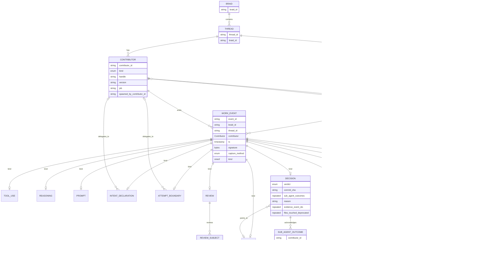

# Entity Relations

This chart shows the core protocol entities and their relationships.

Important edges:

- A thread can have multiple contributors.
- A contributor can spawn another contributor, which models sub-agents.
- Intent and attempts can explicitly delegate to a sub-agent contributor.
- A top-level decision acknowledges sub-agent outcomes instead of each
  sub-agent emitting its own terminal thread decision.
- `Decision.files_touched` is deprecated. The orchestrator computes touched
  files from git commit state.

