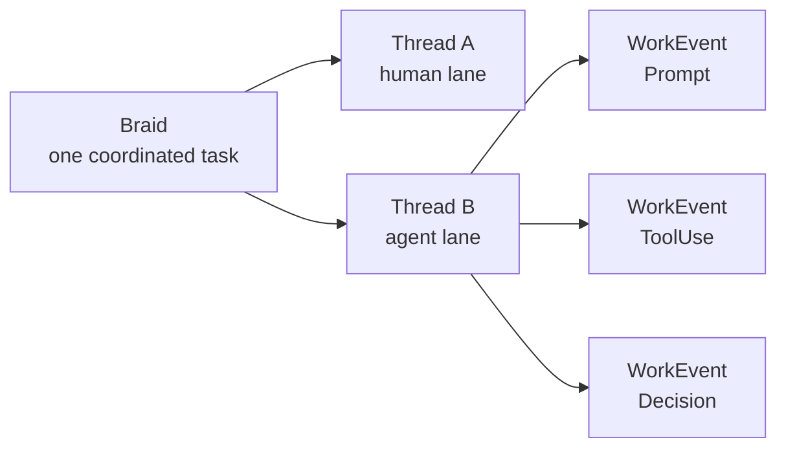

# Protocol Overview

Braid records work as a stream of signed `WorkEvent` messages.

The model has three levels:

- **Braid**: one unit of coordinated work, such as one issue.
- **Thread**: one lane inside a braid, usually tied to a scope or PR.
- **Event**: one recorded action by one contributor inside a thread.

Each event names the contributor that acted, the thread it belongs to, when it
happened, how it was captured, and exactly one payload kind.

The proto is the source of truth for the wire contract. These docs explain the
shape and intent of that contract.

