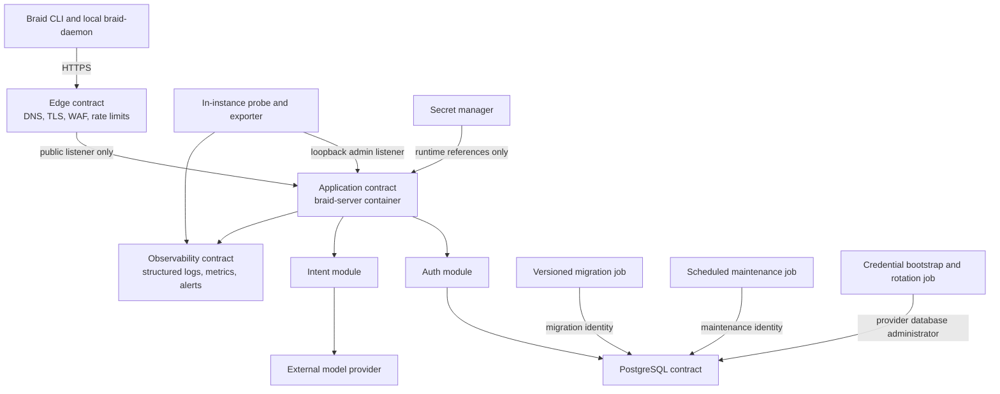
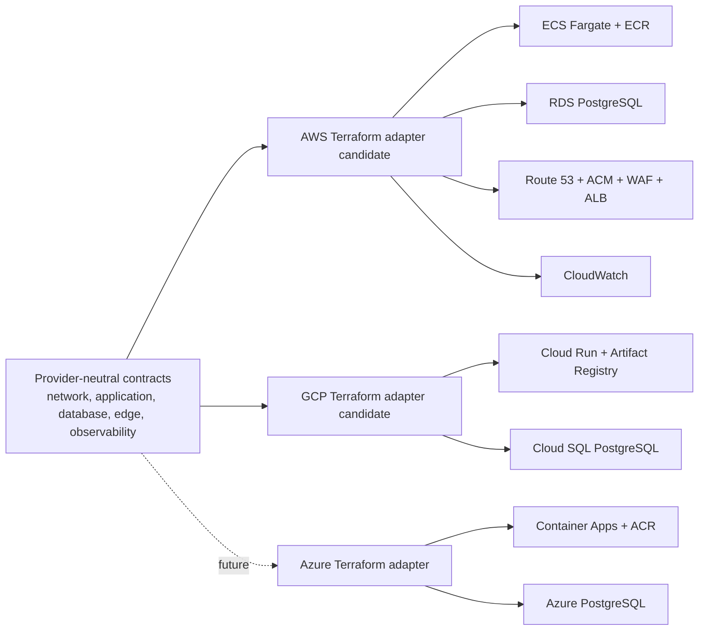
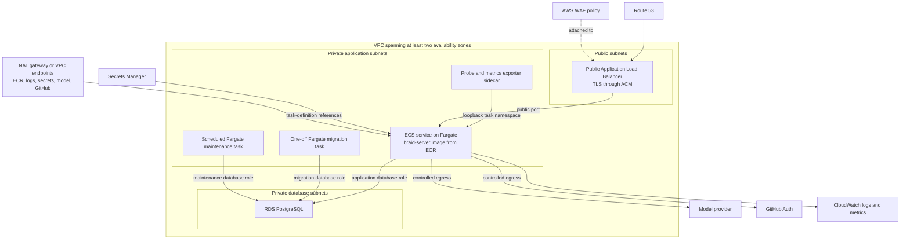
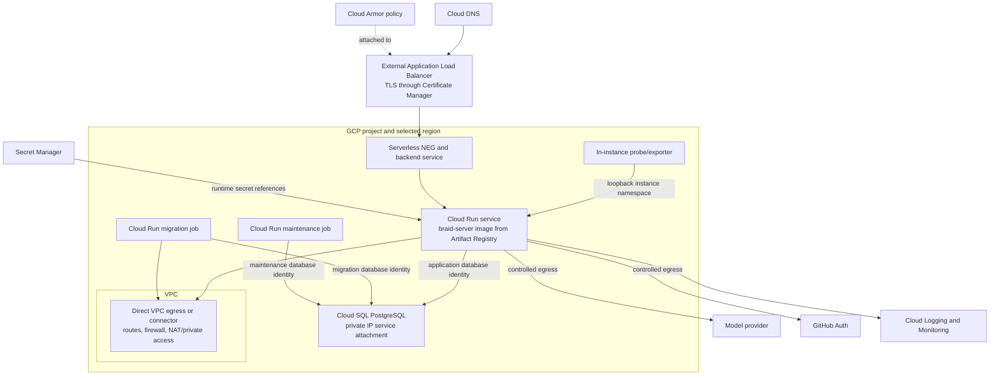

# Provider-Neutral Hosting Architecture

Status: proposed

This document defines the deployment contract for the hosted Braid service.
AWS and GCP are candidate implementations; neither is selected yet. The
application, container, migration, release, and observability contracts remain
independent of that decision.

Auth and Intent are deployed together as one public service named
`braid-server`. They remain separate Go application modules inside that process.
The local `braid-daemon`, review UI, and developer repositories are not hosted
by this stack.

## Design principles

1. Deploy one `braid-server` image containing Auth and protected Intent routes.
2. Keep the application unaware of ECS, Cloud Run, or other provider runtimes.
3. Define stable deployment inputs and outputs, then implement them with
   provider-specific Terraform modules.
4. Keep PostgreSQL migrations outside the public server startup path.
5. Separate staging and production accounts or projects, state, data,
   identities, and secrets. This is mandatory, not a best-effort preference.
6. Pin releases by immutable container-image digest.
7. Keep the admin listener loopback-only and expose only the public listener
   through the ingress tier. In-instance probes and an exporter sidecar consume
   admin signals; no network route reaches the admin listener.
8. Do not invent a universal Terraform resource abstraction. Cloud resources
   remain explicit inside each provider adapter.
9. Give every resource, credential, release transition, and recovery action one
   named owner.
10. Use expand-and-contract database changes so the previous runtime remains
    viable throughout the rollback window.

## Logical deployment contract



The boxes above are contracts, not generic Terraform resources. Each provider
implements them using its native services.

## Provider adapter model



AWS and GCP are evaluated against the same contracts below. Once one is
selected, only that adapter is implemented. The unselected provider remains a
documented alternative rather than an empty Terraform module tree.

## AWS candidate deployment



The ALB must not route to the admin listener. Security groups enforce that the
public listener accepts traffic only from the ALB and PostgreSQL accepts
traffic only from the application, migration, and maintenance tasks. The admin
listener remains loopback-only inside the ECS task namespace. A sidecar or
dedicated health-check binary reads it locally and exports health and metrics.
The staging proof must select NAT gateways or explicit VPC endpoints for every
required outbound dependency; private subnets do not imply working egress.

The current synchronous Intent request can run for approximately ten minutes.
The ALB idle timeout and server write timeout must therefore be configured
above the Intent application deadline. This is an interim compatibility
requirement; a future asynchronous reconstruction API should remove the need
for long-lived public HTTP connections.

## GCP candidate deployment



Cloud Run accepts traffic from the external load balancer only; direct service
URL ingress is disabled or IAM-restricted so it cannot bypass Cloud Armor and
forwarded-header controls. The existing admin listener remains loopback-only
inside the instance and is never routed by the external load balancer. A
provider-neutral in-instance probe/exporter must collect the required admin
signals. Both the serverless NEG path and the probe arrangement require a
staging proof because Cloud Run's ingress model differs from an ECS task.

The Cloud Run request timeout must be configured above the Intent application
deadline. Cloud Run supports the current approximately ten-minute synchronous
request, but asynchronous reconstruction remains the preferred long-term
protocol for the same reasons described in the AWS candidate.

Cloud SQL uses private IP connectivity from the Cloud Run service and migration
job. The application continues to receive an ordinary PostgreSQL connection
contract; it does not import GCP libraries merely to reach the database.

## Candidate comparison

| Concern | AWS candidate | GCP candidate |
|---|---|---|
| Container runtime | ECS service on Fargate | Cloud Run service |
| Container registry | ECR | Artifact Registry |
| PostgreSQL | RDS PostgreSQL | Cloud SQL PostgreSQL |
| Public ingress | WAF, ALB, ACM, Route 53 | Cloud Armor, external load balancer, Certificate Manager, Cloud DNS |
| Migration runtime | One-off Fargate task | Cloud Run job |
| Runtime identity | IAM task role | Service account |
| Secrets | Secrets Manager | Secret Manager |
| Observability | CloudWatch | Cloud Logging and Monitoring |
| Long synchronous request | Explicit ALB and server timeout alignment | Explicit Cloud Run and server timeout alignment |
| Admin listener | Private task port is a natural fit | Loopback listener requires probe/exporter staging proof |
| Operational character | More explicit networking and service configuration | Less infrastructure, more managed runtime behavior |

The provider decision should be made from a small staging spike that proves the
same image, migration, Auth callback, PostgreSQL connection, ten-minute Intent
request, private admin behavior, and observability contract on each serious
candidate. Feature count alone is not sufficient.

## Terraform layout

```text
deploy/
├── terraform/
│   ├── contracts/
│   │   ├── application.md
│   │   ├── database.md
│   │   ├── edge.md
│   │   ├── network.md
│   │   └── observability.md
│   ├── bootstrap/
│   │   └── <selected-provider>/
│   ├── modules/
│   │   ├── <selected-provider>/
│   │   │   ├── braid-server/
│   │   │   ├── postgres/
│   │   │   ├── network/
│   │   │   ├── edge/
│   │   │   └── observability/
│   │   └── shared/
│   │       └── validation/
│   └── environments/
│       └── <selected-provider>/
│           ├── staging/
│           └── production/
├── migrations/
└── container/
    ├── braid-server.Dockerfile
    └── migration.Dockerfile
```

Replace `<selected-provider>` with `aws` or `gcp` after the staging decision.
Do not create empty trees for the unselected provider. The contract documents
are the portability boundary until another provider is implemented.

## Module contracts

### Resource ownership and dependency direction

Each environment root composes sibling modules and is the only layer allowed
to connect their outputs to one another. Sibling modules must not read each
other's state or discover resources by naming convention.

| Owner | Resources it creates and manages |
|---|---|
| `network` | VPC, subnets, route tables, NAT or private endpoints, firewall/security-group foundations, and private service connectivity |
| `postgres` | RDS or Cloud SQL instance/cluster, subnet or private-service attachment, parameter configuration, backup policy, and secret containers for database identities |
| `edge` | DNS records, certificate validation, load balancer, listeners, target groups or serverless backend/NEG, WAF/Cloud Armor policy, edge probes, and access logs |
| `braid-server` | ECS service/task definition or Cloud Run service/revision, runtime and job identities, service-level firewall rules, probe/exporter, secret references, and deployment alarms |
| `observability` | Log destinations, metrics, dashboards, alerts, retention, and export sinks |
| environment root | Cross-module wiring, validated capacity budget, public names, and provider-specific policy bindings that span module ownership |
| release pipeline | Immutable image and migration digests, reviewed release plan, migration execution, runtime rollout, traffic promotion, and rollback decision |

Terraform owns long-lived infrastructure and the runtime revision declaration.
The release pipeline is the sole actor that changes the deployed image digest:
it supplies the digest to Terraform and applies the exact reviewed release
plan. No second deploy command may mutate the service behind Terraform.

### Application inputs

The provider adapter must accept equivalents of:

- service name and environment;
- immutable application and migration image digests from the same commit;
- CPU and memory allocation;
- minimum and maximum instance counts;
- public and admin ports;
- liveness, readiness, and public health paths;
- Intent request deadline and transport timeout;
- non-secret environment variables;
- references to secrets held outside Terraform state; and
- a PostgreSQL connection reference.

It must expose equivalents of:

- canonical public origin;
- runtime service identity;
- private admin endpoint or discovery information;
- log and metric destinations; and
- immutable deployment or task-definition identity.

Auth and Intent intentionally share a process in the first hosted release.
This also means they share a failure domain, CPU, memory, file descriptors,
deployment cadence, and the process-visible secret set. Package boundaries do
not remove that operational coupling. Production admission requires:

- an Intent concurrency ceiling and request-size ceiling per instance;
- CPU and memory headroom measured while Auth traffic runs beside saturated
  Intent traffic;
- Auth latency and availability SLOs that remain satisfied in that test;
- separate runtime, migration, and maintenance identities even though Auth and
  Intent share the runtime identity; and
- preserving module and configuration boundaries so the two modules can be
  deployed separately later if measured SLOs require it.

### Database contract

The database adapter must provide:

- a supported PostgreSQL version;
- encryption in transit and at rest;
- private network access;
- separate application, migration, and maintenance identities;
- automated backups and point-in-time recovery;
- production deletion protection;
- observable connection, storage, and availability metrics; and
- a tested restore procedure.

The connection secret is stored in the provider secret manager. Terraform may
create the secret container and IAM relationship, but plaintext secret values
must not be committed or passed through ordinary Terraform variables.

Database identity lifecycle has the following explicit owners:

1. The `postgres` module creates the database service, secret containers, and
   grants the bootstrap workload access to the provider administrator secret.
2. A dedicated bootstrap/rotation job creates physical `NOINHERIT LOGIN`
   identities for application, migration, and maintenance access and grants the
   repository's logical `NOLOGIN` roles. The public server never receives the
   provider administrator credential.
3. The job writes generated credentials directly to the provider secret
   manager. Secret values never enter Terraform variables, plans, outputs, or
   state.
4. Runtime, migration, and maintenance workloads receive only their own secret
   reference and the provider PostgreSQL CA bundle. TLS verification is
   mandatory.
5. Rotation creates a new secret version and database credential, rolls or
   drains consumers, verifies the new version, and then revokes the old
   credential. Emergency revocation uses the same job and an operator-approved
   break-glass path.

The database connection budget is a deployment invariant:

```text
(maximum runtime instances * runtime pool maximum)
+ migration pool maximum
+ maintenance pool maximum
+ operator and recovery reserve
<= PostgreSQL max_connections - provider reserve
```

The environment root validates this equation with Terraform preconditions.
Autoscaling limits cannot be raised independently of the pool and database
budget. Alerts fire before the reserved ceiling is consumed.

### Edge contract

The edge adapter owns:

- DNS and certificate validation;
- TLS termination;
- public routing to the `braid-server` public listener;
- request-size and rate controls;
- WAF policy;
- access logging; and
- an idle timeout compatible with the current synchronous Intent deadline.

The admin listener is explicitly outside the edge contract.

The edge is the trust boundary for client addressing. It strips client-supplied
`Forwarded`, `X-Forwarded-For`, `X-Forwarded-Proto`, and related headers and
then appends a canonical provider-generated chain. The runtime accepts those
headers only from configured load-balancer peers; direct runtime ingress is
blocked. Staging tests must prove both spoof rejection and preservation of the
real client address.

Rate limiting is deliberately layered:

- the edge owns authoritative distributed IP, request-size, and coarse route
  limits;
- the process-local limiter remains defense in depth and is not described as a
  global limit; and
- any strict account/principal-wide limit must use a shared state service and
  is a separate production gate. Multiplying instances must never silently
  multiply a limit represented to users as global.

### Observability contract

Every implementation must collect:

- structured process and HTTP logs from standard output;
- liveness and readiness;
- Auth latency and error rate;
- Intent admission, concurrency, latency, timeout, and provider failures;
- PostgreSQL health, connections, capacity, and backup status;
- deployment health and rollback events; and
- alerts tied to documented service-level objectives.

## Release sequence

```mermaid
flowchart LR
    subgraph BUILD["1. Build immutable artifact"]
        SOURCE["Git commit"] --> CHECKS["Test, vet, build, scan"]
        CHECKS --> CHECK_OK{"Checks pass?"}
        CHECK_OK -->|"yes"| APP_IMAGE["Publish braid-server image"]
        CHECK_OK -->|"yes"| MIGRATION_IMAGE["Publish migration image"]
        APP_IMAGE --> DIGEST["Record both immutable digests<br/>against one commit"]
        MIGRATION_IMAGE --> DIGEST
    end

    subgraph INFRA["2. Review the exact release"]
        DIGEST --> PLAN["Terraform release plan<br/>pins app and migration digests"]
        PLAN --> PLAN_OK{"Plan approved?"}
    end

    subgraph DATABASE["3. Expand schema before rollout"]
        PLAN_OK -->|"yes"| MIGRATE["Run compatible migration<br/>with pre-provisioned job"]
        MIGRATE --> MIGRATION_OK{"Migration succeeds?"}
    end

    subgraph DEPLOY["4. Roll out and verify"]
        MIGRATION_OK -->|"yes"| APPLY["Apply exact reviewed Terraform plan"]
        APPLY --> ROLLOUT["Create runtime revision and canary traffic"]
        ROLLOUT --> HEALTH["Observe readiness, errors,<br/>latency, and saturation"]
        HEALTH --> HEALTHY{"Healthy?"}
        HEALTHY -->|"yes"| RELEASED["Mark release successful"]
        HEALTHY -->|"no"| ROLLBACK["Restore previous runtime revision"]
        ROLLBACK --> PREVIOUS["Previous revision keeps serving"]
    end

    CHECK_OK -->|"no"| STOP_BUILD["Stop before publishing"]
    PLAN_OK -->|"no"| STOP_PLAN["No infrastructure change"]
    MIGRATION_OK -->|"no"| STOP_RELEASE["Stop rollout;<br/>previous revision keeps serving"]
```



Terraform provisions the migration runtime and its permissions. The release
pipeline runs migrations and applies the exact Terraform release plan;
Terraform provisioners do not run migrations and no provider CLI separately
deploys the image.

Every pre-rollout migration must be compatible with both the currently serving
runtime and the candidate runtime. Schema and data removal occurs only in a
later contract release after the rollback window. Runtime rollback therefore
moves traffic back to the previous immutable revision; it never attempts an
automatic down migration. The application and migration artifacts come from
the same Git commit and their digests are recorded together.

The current synchronous Intent API also needs explicit release semantics:
requests carry an idempotency key, retry only before a terminal response,
observe a bounded application deadline, and are allowed a documented drain
window during deployment. A staging chaos test must cover instance termination
during reconstruction. Merely aligning ten-minute timeouts is not sufficient.

## Environment isolation

Staging and production use the same selected-provider modules but run in
different cloud accounts or projects. They have separate:

- cloud accounts or projects without exception;
- Terraform state and locking;
- networks and firewall policies;
- runtime services and workload identities;
- PostgreSQL instances, users, and backups;
- secrets and model-provider credentials;
- hostnames and certificates; and
- logs, alerts, and operational access.

They also use separate state backends, encryption keys, CI deployment
identities, quotas, and break-glass roles. A staging principal cannot apply or
read production state, secrets, or data. Production deployment requires an
environment approval and a production-scoped short-lived identity.

Promotion means reusing the same tested image digest in production. It does not
mean rebuilding the image from the same Git commit.

## Terraform state and delivery controls

The selected provider's bootstrap stack creates the remote state backend before
environment stacks are initialized. State must be encrypted, versioned,
access-controlled, and locked against concurrent writers. Staging and
production must not share a state file.

Pull requests run formatting, validation, policy checks, and speculative plans.
Deployment automation creates a final plan, records it for review, and applies
that exact plan. State files and saved plans are never committed because both
may contain sensitive values.

## Container and artifact contract

The repository's current root `Dockerfile` packages the legacy `braid-auth`
binary. It is not the production artifact described here and must not be
silently reused as one. The hosted rollout adds a production multi-stage
`deploy/container/braid-server.Dockerfile` that:

- builds and runs the combined `braid-server` binary as a non-root user;
- includes the CA roots required for GitHub, the model provider, PostgreSQL,
  and telemetry export;
- exposes only the public listener to the platform;
- includes a dedicated in-instance health-check binary or sidecar contract;
- emits OCI source/revision labels, an SBOM, vulnerability scan result, and
  signed provenance; and
- publishes an immutable digest.

A separate migration image is built from the same commit and includes only the
migration entry point and required CA material. The release record binds both
digests. The existing Auth container remains explicitly labeled development or
legacy until its Cloudflare cutover is complete, then is retired.

## Existing Cloudflare Auth cutover

`deploy/cloudflare/auth-dev` and the existing Auth maintenance workflow are an
incumbent deployment path that must be inventoried, not ignored. Before a
provider is selected, the owner must classify which parts are development-only
and which carry production data or callbacks. The cutover plan is:

1. Inventory Cloudflare Worker/Container routes, Durable Object rate-limit
   behavior, secrets, GitHub App callback origins, DNS, database access, and
   maintenance jobs.
2. Decide for each behavior whether the combined `braid-server` reproduces,
   replaces, or intentionally retires it. In particular, do not replace a
   distributed Durable Object limit with an undocumented per-instance limit.
3. Deploy and validate the combined service in parallel using non-production
   callbacks and traffic.
4. Freeze relevant Auth configuration, switch GitHub callback origins and DNS
   through a reviewed change, and observe both Auth and Intent SLOs.
5. Keep a timed DNS/callback rollback path, then remove the Cloudflare path only
   after the rollback window and data-retention checks pass.

## Disaster recovery contract

Production launch requires named RPO and RTO targets and a tested recovery
runbook for the whole service, not only PostgreSQL. The recovery set includes:

- PostgreSQL backups, WAL/PITR capability, roles, extensions, and a verified
  restore into an isolated environment;
- versioned Terraform state, bootstrap configuration, lock recovery, and the
  exact module/provider versions needed to recreate infrastructure;
- secret containers and recoverable secret versions, CA material, workload
  identities, and a separately controlled break-glass credential;
- signed application and migration image digests and their artifact registry;
- DNS zones, certificates, WAF policies, GitHub App configuration and callback
  origins, model-provider configuration, and externally stored provenance;
- dashboards, alert policies, log sinks, and operational contacts; and
- documented regional-failure and account-compromise cutover procedures.

At least quarterly, staging restores a production-shaped backup into an
isolated account/project and exercises application startup, authentication,
Intent reconstruction, DNS/certificate replacement, and operator access. The
test records achieved RPO/RTO and remediation work.

## Production admission gates

Production is blocked until all of the following are demonstrated in staging:

- combined `braid-server` and migration images are built, scanned, signed, and
  tied to one commit;
- database identities can be bootstrapped, rotated, and revoked without placing
  plaintext secrets in Terraform state;
- connection-budget validation rejects unsafe autoscaling or pool settings;
- spoofed forwarding headers and direct edge bypass are rejected;
- Auth meets its SLO while Intent consumes its configured concurrency budget;
- in-instance readiness and metrics work without exposing the admin listener;
- expand-and-contract migration, canary rollout, request drain, and runtime
  rollback work as documented;
- the Cloudflare Auth inventory and cutover disposition are approved; and
- the full-service restore runbook meets the selected RPO and RTO.

## Decisions still required

1. Select AWS or GCP using a time-boxed staging proof of the contracts above.
2. Select regions; staging and production account/project separation is already
   mandatory.
3. Select the Terraform remote-state implementation and CI identity model.
4. Decide the staging PostgreSQL availability and cost profile for RDS or Cloud
   SQL.
5. Set numeric production RPO/RTO, backup retention, and restore-test cadence.
6. Define the public hostname and GitHub Auth callback origins per environment.
7. Set the initial runtime size, concurrency, and autoscaling limits from load
   tests rather than guesses.
8. Decide when synchronous Intent reconstruction must move to an asynchronous
   job protocol.
9. Decide whether strict principal-wide rate limiting is required at launch and
   select its shared state service if it is.
10. Complete the Cloudflare Auth inventory and approve each migrate/replace/
    retire disposition.

## Explicit non-goals

- Hosting the local review UI or developer repositories.
- Moving `braid-daemon` into the hosted service.
- Introducing Kubernetes.
- Implementing multiple cloud providers before one is required.
- Combining privileged migrations with `braid-server` startup.
- Retiring compatibility server commands before deployment and rollback are
  proven in staging.
