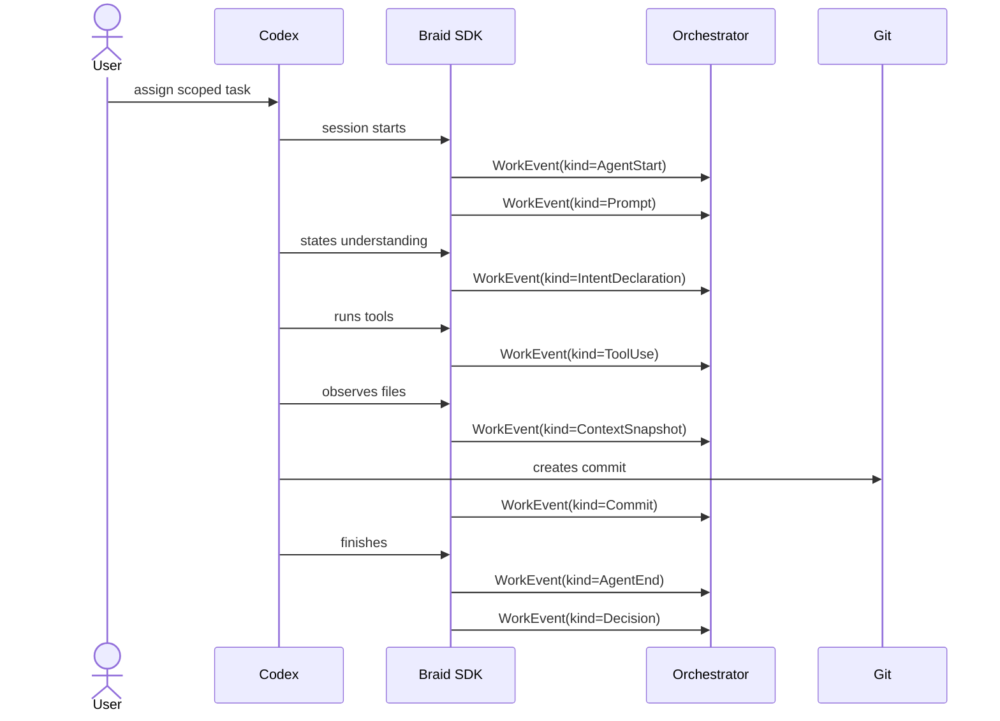

# Agent Thread

Codex works inside a Braid thread through a harness or SDK adapter.

Example event sequence:

| User or agent moment | Event sent | Why it matters |
| --- | --- | --- |
| User assigns task | `Prompt` | Reviewers can see the directive the agent received. |
| Agent starts | `AgentStart` | Captures model and instruction files loaded. |
| Agent forms intent | `IntentDeclaration` | Shows the agent's working understanding. |
| Agent calls tools | `ToolUse` | Captures tool inputs, outputs, status, and redaction flags. |
| Agent reads files | `ContextSnapshot` | Records which files shaped the work. |
| Agent commits | `Commit` | Links event stream to git state. |
| Agent exits | `AgentEnd` | Captures reason, tokens, and cost. |
| Agent decides | `Decision` | Gives the thread its terminal verdict. |

