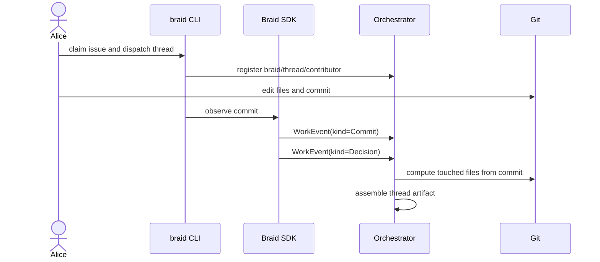

# Human Thread

Alice works directly in her editor, commits the change, and records the thread
outcome.

Example event sequence:

| User action | Event sent | Why it matters |
| --- | --- | --- |
| Alice starts work | none yet | The thread already exists from dispatch. |
| Alice commits | `Commit` | Braid can point to the git object that stores the diff. |
| Alice marks complete | `Decision` | The promote gate gets a terminal verdict. |
| Orchestrator accepts decision | no client event | Touched files are computed from git, not trusted from Alice. |

