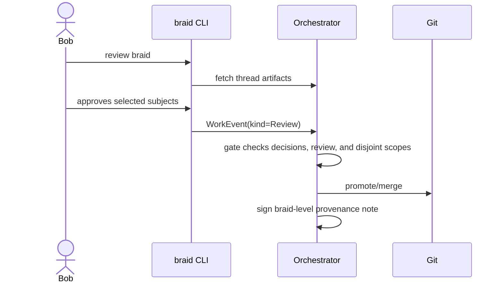

# Review and Promote

Review is itself work. A reviewer emits a `Review` event that says what was
examined and what verdict they reached.

Example review subjects:

| Subject kind | Example |
| --- | --- |
| `EVENT` | Bob reviews one specific `WorkEvent`, such as a risky tool use. |
| `THREAD` | Bob approves one thread's final artifact. |
| `CONTRIBUTOR` | Bob reviews all work by a specific agent session. |
| `COMMIT` | Bob approves a git commit. |
| `BRAID` | Bob approves the coordinated work as a whole. |
