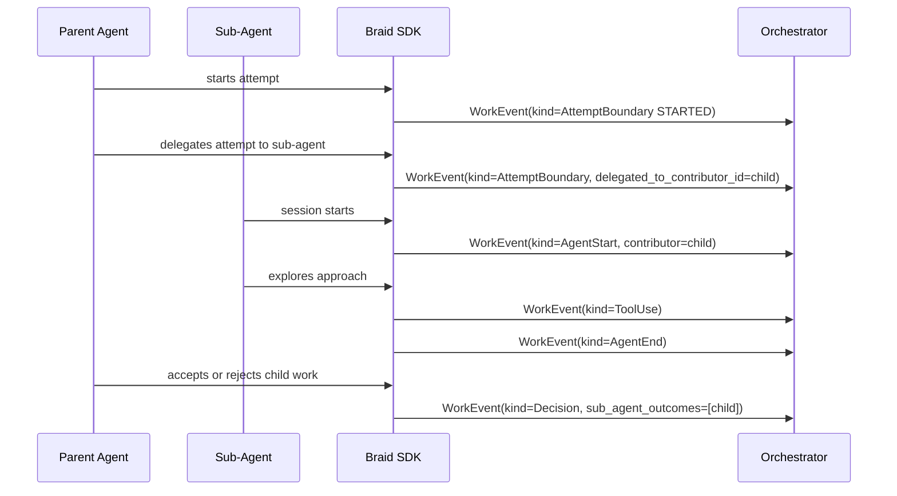

# Sub-Agent Delegation

A parent agent can delegate part of an intent or attempt to a sub-agent. The
sub-agent emits its own events, while the parent rolls the outcome into the
thread decision.

Key rule: sub-agent work is traced through contributor lineage and explicit
delegation fields. The parent thread decision acknowledges what happened to
that work.

